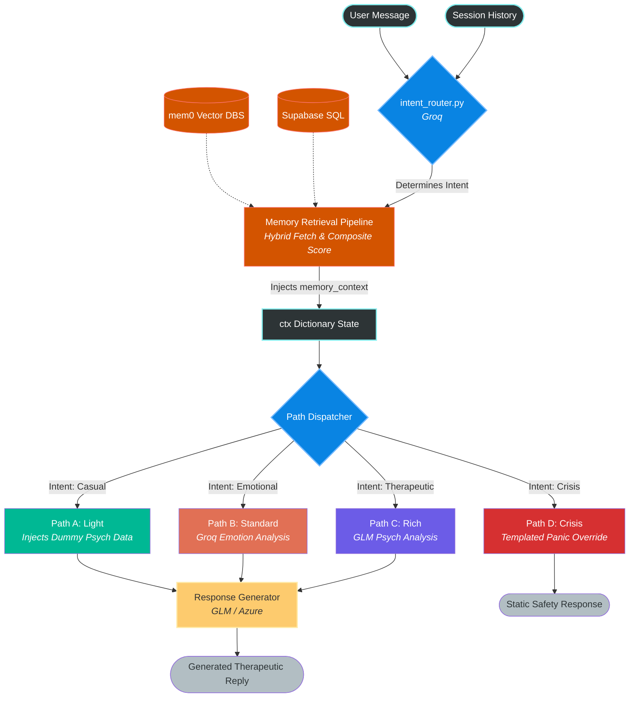

# MindMitra Request Pipeline Architecture

## 1. Does Path A Get the Retrieved Memory?
**Yes.** Memory retrieval happens centrally in the `route_and_execute` orchestrator method **before** the system decides which generation path to take. 

When a user sends a message:
1. `IntentRouter` runs quickly to classify it (e.g., as `casual`).
2. A parallel thread pool spins up to fetch `mem0` memories via vector search and the user's `emotional_trend`.
3. The retrieved memories are packaged into `ctx["memory_context"]`.
4. Only *then* does the system branch out. Path A (casual) inherits this fully populated `ctx` block. In Path A, the system prompt actively instructs the response generator: *"Memory is available but don't force callbacks on a casual turn — use only if it fits naturally."*

---

## 2. Pipeline Paths Breakdown
At every step, `ctx` (Context Dictionary) acts as the central state vehicle containing the `user_message`, `history`, and `memory_context`.

### **Path A: The Light Path (Casual)**
- **Trigger:** Evaluated as `casual` (small-talk, greetings, basic questions).
- **Core Goal:** Fast, warm connection. Zero clinical overhead to save API latency and costs.
- **Inputs to Path:** `ctx` (includes user message, history, and retrieved memory).
- **Steps:**
  1. **Skip Analysis:** Bypasses LLM emotion/psychological analysis entirely.
  2. **Hardcode Psychology:** Manually injects dummy clinical data into `ctx`: `{"emotional_state": "casual", "risk_assessment": "low"}`.
  3. **Response Generation:** Directly invokes the `ResponseGenerator` (GLM/Azure) with a `temperature` of 0.8 and a strict directive to keep it short and avoid therapeutic probing.

### **Path B: The Standard Path (Emotional)**
- **Trigger:** Evaluated as `emotional` (user is sharing feelings, venting, seeking validation but not in crisis/requiring deep intervention).
- **Core Goal:** Validation and empathetic presence.
- **Inputs to Path:** `ctx`.
- **Steps:**
  1. **Fast Emotion Analysis:** Calls `AnalysisEngine.combined_emotion_cultural_analyse()` using the fast Groq (`qwen3-32b`) model.
  2. **Enrich Context:** Associates the `user_message` with extracted `primary_emotion`, `cultural_pressure`, and `user_needs`.
  3. **Response Generation:** Invokes the `ResponseGenerator` (GLM/Azure). The system prompt uses the emotion analysis to construct an empathetic reflection.

### **Path C: The Rich Path (Therapeutic)**
- **Trigger:** Evaluated as `therapeutic` (user explicitly needs coping strategies, deep processing, or displays complex psychological needs).
- **Core Goal:** Deep clinical insights, re-framing, and problem-solving without sounding clinical.
- **Inputs to Path:** `ctx`.
- **Steps:**
  1. **Deep Psych Analysis:** Calls `AnalysisEngine.optimized_psych_analysis()` using the heavyweight GLM/Azure model.
  2. **Enrich Context:** Formulates a highly clinical extraction yielding `primary_stressor`, `intervention` strategies (e.g., "reframe", "ground"), and `insight`.
  3. **Response Generation:** Invokes the `ResponseGenerator` (GLM/Azure). The system prompts leverage the clinical `intervention` matrix to actively guide the user.

### **Path D: The Crisis Path (Danger Check)**
- **Trigger:** Evaluated as `crisis` by the initial `intent_router` or caught by the fallback regex keyword filter.
- **Core Goal:** Immediate safety guardrails. Zero hallucination tolerance.
- **Inputs to Path:** `ctx`.
- **Steps:**
  1. **Interception:** Handed off directly to `CrisisManager.crisis_fast_path(ctx)`.
  2. **Static Response:** Analyzes language and directly returns pre-approved templated responses loaded with localized crisis hotline numbers (e.g., Vandrevala Foundation) rather than generating an LLM response.

---

## 3. Pipeline Visualization

