# MindMitra — Current (v1) Architecture · Visual Reference

> Snapshot of the **production-active** stack as of `2026-04-19`.
> Every number, model id, and threshold below is sourced directly from
> `chatbotAgent/config.yaml`, `app/utils/constants.py`, and the live
> orchestrator code. This document describes the legacy path that runs
> **whenever `MITRA_STACK_ENABLED=0` (default)**.

---

## 0. Legend used in every diagram

```
🟦 = HTTP / SSE boundary           🟩 = LLM call (named model)
🟧 = External provider             🟨 = Background thread (fire-and-forget)
🟥 = Safety / Crisis               🟪 = Vector / Memory store
🟫 = Postgres (Supabase)           ⏱ = Timeout / deadline
```

Click any section header to jump straight to its diagram.

- [1. End-to-end request lifecycle](#1-end-to-end-request-lifecycle-pochat--postchatstream)
- [2. Pipeline orchestrator (router → A/B/C/D)](#2-pipeline-orchestrator--router--paths-abcd)
- [3. Path-by-path detail (LLMs, models, tokens, temperature)](#3-path-by-path-detail)
- [4. Memory subsystem (mem0 + Qdrant + Supabase)](#4-memory-subsystem)
- [5. Memory retrieval & composite scoring](#5-memory-retrieval--composite-scoring)
- [6. Background jobs (memory, summary, screening, reflection)](#6-background-jobs-fire-and-forget)
- [7. Voice prosody pipeline](#7-voice-prosody-pipeline-praat--parselmouth)
- [8. LLM model registry (single source of truth)](#8-llm-model-registry-single-source-of-truth)
- [9. Critical numbers & timeouts cheat sheet](#9-critical-numbers--timeouts-cheat-sheet)
- [10. Failure modes & fallbacks](#10-failure-modes--fallbacks)

---

## 1. End-to-end request lifecycle (`POST /chat` & `POST /chat/stream`)

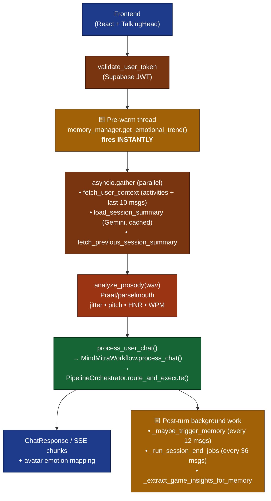

**Key facts**

| Item | Value | Source |
|---|---|---|
| Auth | Supabase JWT (`Bearer <token>`), service-role client bypasses RLS, IDOR enforced in code | `core/auth.py` |
| Recent messages fetched per turn | **10** | `MAX_MESSAGES_FETCH=10` |
| User activities fetched per turn | **50** | `MAX_ACTIVITIES_FETCH=50` |
| Memory-extraction trigger | every **12** messages | `MEMORY_TRIGGER_INTERVAL=12` |
| Session-end jobs trigger | every **36** messages (`12 × 3`) | `chat.py` |
| Streaming polling | **2 ms** (`asyncio.sleep(0.002)`) | `chat.py` |
| Streaming flush boundary | sentence boundary regex `[.!?]\s` | `chat.py` |

---

## 2. Pipeline orchestrator — router → paths A/B/C/D

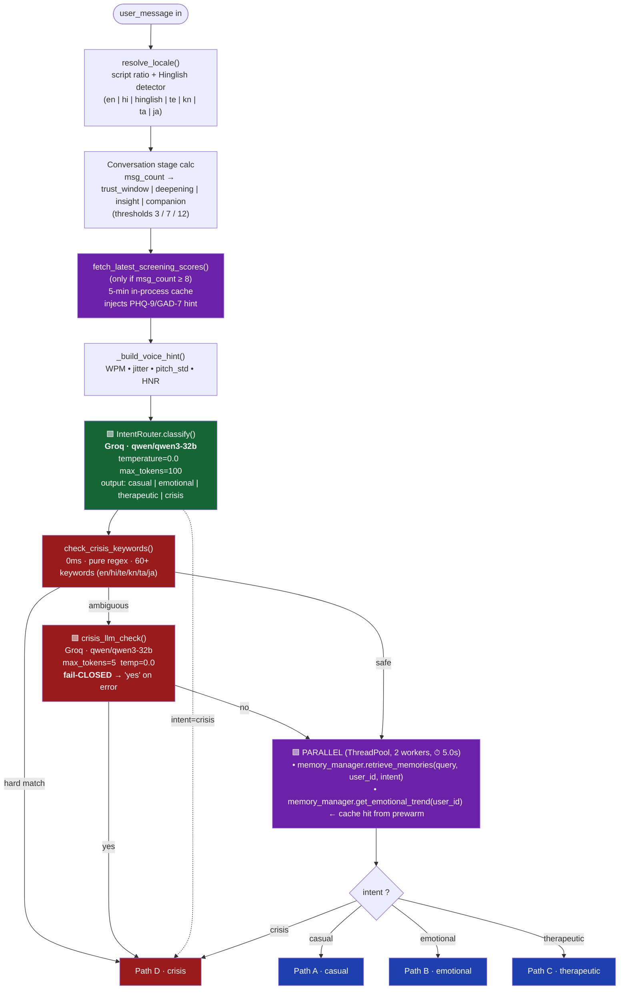

**Stage calculator (`STAGE_*` constants)**

| Session msg-count | Stage | Question cap per response |
|---:|---|---:|
| 1 – 3   | `trust_window` | **1** |
| 4 – 7   | `deepening`    | **1** |
| 8 – 12  | `insight`      | **1** |
| 13 +    | `companion`    | **1** |

(All four caps are intentionally `1` — see `QUESTION_CAP_*` in `constants.py`.)

---

## 3. Path-by-path detail

### Path A — Casual / small-talk

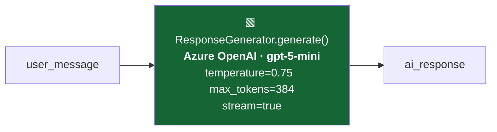

- **1 LLM call total.**
- Memory is **available but NOT forced** ("don't force callbacks on a casual turn").
- Sets `technique_selection.primary_technique = "Companion"`.

### Path B — Emotional / venting

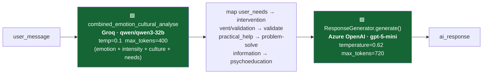

- **2 LLM calls total** (1 Groq analysis + 1 Azure response).
- Pulls **5 memories** (`MEMORY_LIMIT_EMOTIONAL`).

### Path C — Therapeutic / rich

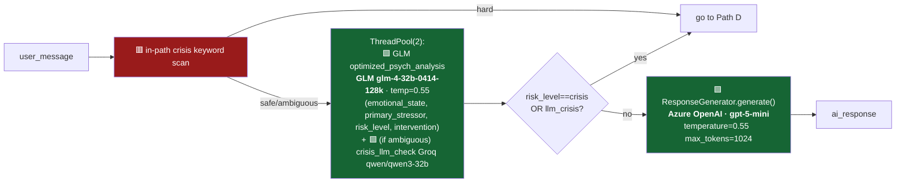

- **2–3 LLM calls** (1 GLM psych + 1 Azure response, optionally + 1 Groq ambiguous-crisis check in parallel).
- Pulls **7 memories** (`MEMORY_LIMIT_THERAPEUTIC`) + always all procedural memories.

### Path D — Crisis (deterministic, no generation LLM)

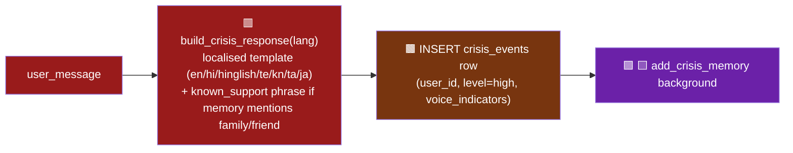

- **0 generation LLM calls.** Deterministic localized template. Sub-second latency.
- Helpline numbers hard-coded inside `_CRISIS_RESPONSE_TEMPLATES` (iCall `9152987821`, Vandrevala `1860-2662-345`, plus Japanese-locale numbers).

### LLM-call count summary

| Path | LLMs invoked | Models | Temps | Max-tokens |
|---|---:|---|---|---:|
| **A — casual** | 1 | Azure `gpt-5-mini` | 0.75 | 384 |
| **B — emotional** | 2 | Groq `qwen/qwen3-32b` + Azure `gpt-5-mini` | 0.1 / 0.62 | 400 / 720 |
| **C — therapeutic** | 2–3 | GLM `glm-4-32b-0414-128k` + Azure `gpt-5-mini` (+ Groq if ambiguous-crisis) | 0.55 / 0.55 | n/a / 1024 |
| **D — crisis** | 0 (1 LLM upstream for ambiguous-keyword confirmation) | Template only | — | — |
| **+ Always upstream** | 1 router | Groq `qwen/qwen3-32b` | 0.0 | 100 |

So a typical **emotional** turn = 1 router + 1 analysis + 1 generator = **3 LLM calls**.
A typical **therapeutic** turn = 1 router + 1 psych + 1 generator = **3 LLM calls** (4 if ambiguous-crisis check fires).

---

## 4. Memory subsystem

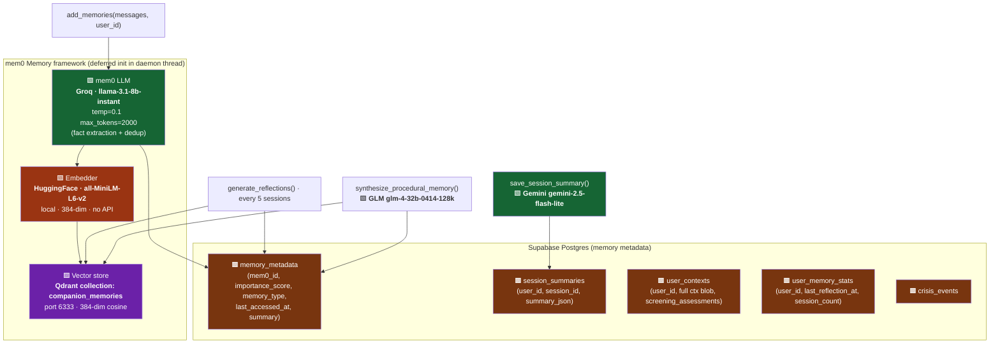

**Three memory **types** stored in `memory_metadata.memory_type`:**

- `semantic`   — facts about the user (mem0 default extraction)
- `procedural` — coping strategies that helped (synthesized by GLM, only when keywords like "breathe", "journal", "ground" appear)
- `reflection` — higher-order patterns (synthesized every 5 sessions)
- `crisis`     — full message snapshot at crisis moment (immediate write)

---

## 5. Memory retrieval & composite scoring

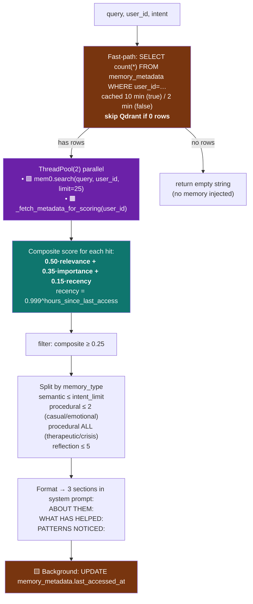

### Per-intent retrieval limits (`MEMORY_LIMIT_*`)

| Intent | Semantic memories returned | Procedural cap | Reflections cap |
|---|---:|---:|---:|
| `casual`      | **3** | 2 | 5 |
| `emotional`   | **5** | 2 | 5 |
| `therapeutic` | **7** | ∞ (all kept) | 5 |
| `crisis`      | **4** | ∞ (all kept) | 5 |

Constants: `MEMORY_OVERFETCH_LIMIT=25` (over-fetched then re-ranked), `MEMORY_RELEVANCE_THRESHOLD=0.25`.

### Score formula (Generative-Agents inspired)

\[
\text{score} = 0.50 \cdot \text{relevance}_{\text{cosine}} + 0.35 \cdot \frac{\text{importance}_{1..10}}{10} + 0.15 \cdot 0.999^{\,\text{hours\_since\_access}}
\]

(`SCORE_WEIGHT_RELEVANCE=0.50`, `SCORE_WEIGHT_IMPORTANCE=0.35`, `SCORE_WEIGHT_RECENCY=0.15`, `RECENCY_DECAY_RATE=0.999` per hour ≈ 84 % at one week.)

---

## 6. Background jobs (fire-and-forget)

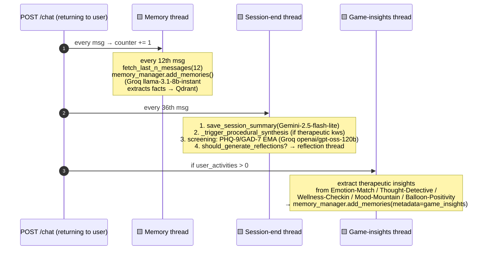

Reflection trigger: `REFLECTION_INTERVAL_SESSIONS=5`, fetches top **30** memories by importance, emits up to **5** insights.

Screening EMA: `SCREENING_EMA_ALPHA=0.6` (60 % weight to new score), gated at `SCREENING_MIN_MESSAGES=8`.

---

## 7. Voice prosody pipeline (Praat / parselmouth)

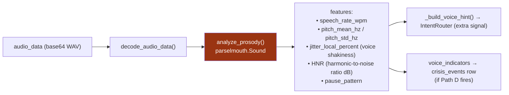

**Heuristics that bias the router:**
- `jitter > 2.0%` → "voice shakiness"
- `pitch_std < 15 Hz` → "monotone voice"
- `pitch_std > 60 Hz` → "highly variable pitch"
- `HNR < 8 dB` → "breathy/unclear voice"

A separate STT fallback exists at `POST /transcribe` using **Groq Whisper `whisper-large-v3-turbo`** (called by frontend only when the Azure Speech SDK returns empty).

---

## 8. LLM model registry (single source of truth)

| Job | Provider | Model | Temp | Max-tok | File |
|---|---|---|---:|---:|---|
| Intent routing | Groq | `qwen/qwen3-32b` | 0.0 | 100 | `intent_router.py` |
| Crisis LLM check | Groq | `qwen/qwen3-32b` | 0.0 | 5 | `crisis_manager.py` |
| Combined emotion+culture (Path B) | Groq | `qwen/qwen3-32b` | 0.1 | 400 | `analysis_engine.py` |
| Psych analysis (Path C) | GLM (ZhipuAI) | `glm-4-32b-0414-128k` | 0.55 | model-decided | `analysis_engine.py` |
| Response generation (all paths) | **Azure OpenAI** | **`gpt-5-mini`** (low reasoning effort) | 0.55–0.75 | 384 / 720 / 1024 | `azure_controller.py` |
| Response fallback (if `llm_provider="glm"`) | GLM | `glm-4-32b-0414-128k` | same | same | `llm_controller.py` |
| Mem0 fact extraction | Groq | `llama-3.1-8b-instant` | 0.1 | 2000 | `memory_store.py` |
| Embeddings (memory) | HuggingFace local | `all-MiniLM-L6-v2` (384-dim) | — | — | `memory_store.py` |
| Session summaries | Google | `gemini-2.5-flash-lite` | default | default | `memory_store.py` |
| Procedural synthesis | GLM | `glm-4-32b-0414-128k` | default | default | `memory_reflection.py` |
| Reflection generation | Groq | configured `nlp_module.model` | default | default | `memory_reflection.py` |
| PHQ-9 / GAD-7 screening | Groq | `openai/gpt-oss-120b` | 0.0 | 280 | `screening_agent.py` |
| Speech-to-text fallback | Groq | `whisper-large-v3-turbo` | — | — | `chat.py /transcribe` |

The **active** generator is selected by `response_generator.llm_provider` in `config.yaml`. Currently `"azure"`. Toggle to `"glm"` to fall back to GLM with the same per-path token budgets.

---

## 9. Critical numbers & timeouts cheat-sheet

| Knob | Value | Where it lives |
|---|---:|---|
| `MAX_MESSAGES_FETCH` (recent context) | 10 | `constants.py` |
| `MAX_ACTIVITIES_FETCH` | 50 | `constants.py` |
| `MEMORY_TRIGGER_INTERVAL` | 12 | `constants.py` |
| Session-end jobs trigger | every 36 msgs (`12×3`) | `chat.py` |
| `MEMORY_OVERFETCH_LIMIT` | 25 | `constants.py` |
| `MEMORY_RELEVANCE_THRESHOLD` | 0.25 | `constants.py` |
| `MEMORY_LIMIT_CASUAL / EMOTIONAL / THERAPEUTIC / CRISIS` | 3 / 5 / 7 / 4 | `constants.py` |
| Memory pipeline parallel timeout | **5.0 s** (then continue without memory) | `config.yaml → performance.pipeline_memory_parallel_timeout_seconds` |
| `glm_timeout` / `groq_timeout` | 60 s / 30 s | `config.yaml` |
| `memory_retrieval_timeout` | 10 s | `config.yaml` |
| Stage thresholds | 3 / 7 / 12 | `STAGE_*` constants |
| Question caps per stage | all = **1** | `QUESTION_CAP_*` |
| Greeting cache TTL | 600 s | `GREETING_CACHE_TTL_S` |
| Screening cache TTL | 300 s | `_SCREENING_CACHE_TTL_S` |
| Has-memories cache TTL | 600 s (true) / 120 s (false) | `memory_retriever.py` |
| Emotional-trend cache TTL | 3600 s | `memory_store.py` |
| Reflection trigger | every 5 sessions | `REFLECTION_INTERVAL_SESSIONS` |
| Reflection top-N | 30 memories | `REFLECTION_MEMORY_FETCH_LIMIT` |
| Screening EMA α | 0.6 | `SCREENING_EMA_ALPHA` |
| Stream polling interval | 2 ms | `chat.py` |
| Avatar emotion buckets | 7 (empathy, concern, encouragement, acknowledgment, calm, listening, default) | `chat.py::_detect_emotion` |

---

## 10. Failure modes & fallbacks

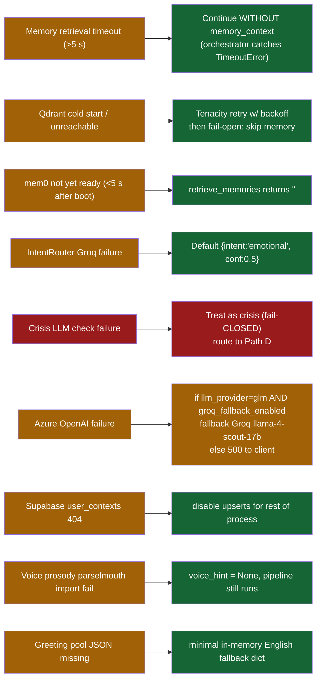

### Hard safety guarantees

1. **Crisis-keyword scan cannot be bypassed.** Even if the router says `casual`, the orchestrator re-runs `check_crisis_keywords()` and overrides to `crisis` on hard match.
2. **`crisis_llm_check` fails CLOSED.** Empty output, network error, or all-retry-fail → treat the user as in crisis.
3. **IDOR-protected reads.** Every Postgres query includes `eq("user_id", authenticated_uid)` despite the service-role key bypassing RLS.
4. **No raw user transcripts in logs.** `redact_text()` runs before any user-message logging in `chat.py` and `intent_router.py`.

---

## Appendix — request → response timing budget (typical Path B turn)

```mermaid
gantt
    title One emotional turn — wall-clock target ~1.6 s
    dateFormat  X
    axisFormat  %s
    section Network
    SSE handshake & auth        :a1, 0, 50
    section Pre-fetch
    fetch_user_context (parallel) : 50, 250
    Voice prosody (Praat)         : 50, 180
    Pre-warm trend cache (bg)     :crit, 0, 10
    section Routing
    IntentRouter (Groq)           :a2, 250, 500
    Crisis keyword scan           : 500, 502
    section Memory
    retrieve_memories + trend (parallel, ⏱5s) : 502, 800
    section Generation
    Path-B combined analysis (Groq) : 800, 1100
    Azure gpt-5-mini stream start   :crit, 1100, 1600
    section Post
    Sentence-flush SSE chunks       : 1100, 1600
    fire-and-forget memory thread   : 1600, 1610
```

Targets are illustrative; actual numbers depend on Groq/Azure cold-state. The pre-warm thread on line 1 is what makes the *trend* fetch effectively free by the time the orchestrator needs it.
