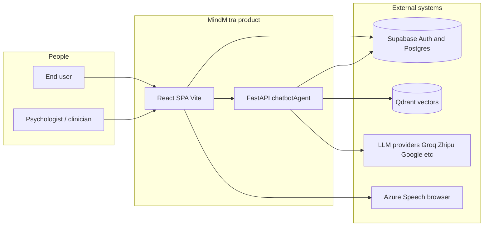

# MindMitra — Master Documentation

**Audience:** engineers, technical founders, and AI agents working in this repository.  
**Goal:** replace tribal knowledge with a **single navigation hub**. Deep implementation detail lives in focused files linked from here — this document is the **map and narrative**, not a paste of every line of code.

**Suggested first read:** Sections 0 → 7 (≈ 60–90 min), then jump to the area you ship (memory, safety, therapist bridge, etc.).

---

## 0. How to use this knowledge base

| If you need… | Read first… | Then deep-dive… |
|--------------|-------------|-----------------|
| System shape & boundaries | §3–5 | `docs/architecture.md` |
| Chat request path & modules | §7 | `docs/backend/ARCHITECTURE.md` §3–8 |
| Memory writes/reads & scoring | §8 | `docs/backend/MEMORY_ARCHITECTURE.md` |
| Path A/B/C/D intuition | §7 | `docs/backend/PIPELINE.md` |
| HTTP schemas | §14 / contracts | `docs/api_contracts.md` |
| RAG + memory vocabulary | §8 | `docs/MEMORY_AND_RAG.md` |
| Evals & CI gates | §15 | `docs/EVALUATION.md` |
| Clinician handoff | §11 | `docs/therapist_bridge.md` |
| MindGym client toolkit | §12 | `docs/mindgym.md` |
| Beta analytics & SQL | §15 | `docs/EVALUATION.md` (Product metrics section), `docs/sql/beta_product_analytics_queries.sql` |
| Qdrant ops | §16 | `docs/backend/QDRANT_SETUP.md` |
| Citations / eval reporting | — | `docs/backend/CITATIONS.md` |

**Principle:** *Master = orientation + decisions + links. Detailed docs = evidence and tables.*

---

## 1. Documentation architecture (meta)

### 1.1 Design goals

We follow common industry practice for internal platform docs:

- **Diátaxis-style layering:** tutorials/how-to (README, guides) vs reference (API contracts, system map) vs explanation (architecture, ADRs).
- **C4 hierarchy:** Context → Containers → Components — so a reader always knows *where* they are in the system.
- **ADRs** for anything that could be asked “why not X instead?”
- **Single hub (this file)** to remove “which doc is true?” — older files become **reference modules**, not competing primaries.

### 1.2 Information architecture (IA)

| Tier | Content |
|------|---------|
| **Hub** | `docs/MASTER_DOCUMENTATION.md` (this file) |
| **Conceptual** | `docs/architecture.md`, `docs/MEMORY_AND_RAG.md` |
| **Backend reference** | `docs/backend/ARCHITECTURE.md`, `docs/backend/MEMORY_ARCHITECTURE.md`, `docs/backend/PIPELINE.md` |
| **Contracts** | `docs/api_contracts.md` |
| **Product / vertical** | `docs/mindgym.md`, `docs/therapist_bridge.md` |
| **Ops & quality** | `docs/EVALUATION.md`, `docs/backend/GETTING_STARTED.md`, `docs/backend/QDRANT_SETUP.md` |
| **AI tooling** | Root `CLAUDE.md`, `AGENT.md`; optional `ai/claude.md` pointer |

### 1.3 Historical material

- The old `_archive/` tree has been **removed** from the working tree to reduce noise; use **git history** if you need a prior snapshot.
- Treat `docs/architecture.md` and `docs/backend/ARCHITECTURE.md` as **complementary**: the first is *system-level*, the second is *backend module-level* (longer).

### 1.4 Old docs → role in the new system

| Location | Role after this merge |
|----------|------------------------|
| `docs/architecture.md` | **System-level** architecture (stays; linked from §3–5) |
| `docs/backend/GETTING_STARTED.md` | **Runbook + route table + pipeline/eval trace** for devs and evaluators |
| `docs/api_contracts.md` | **Canonical HTTP/JSON contracts** |
| `docs/MEMORY_AND_RAG.md` | **Conceptual** memory model + RAG scope (memory vs KB) |
| `docs/EVALUATION.md` | **Tests, eval harness, beta analytics / product metrics** |
| `docs/mindgym.md`, `docs/therapist_bridge.md` | **Feature verticals** |
| `docs/backend/ARCHITECTURE.md` | **Backend deep dive** (tables, endpoints, screening, TTS notes) |
| `docs/backend/MEMORY_ARCHITECTURE.md` | **Memory implementation bible** |
| `docs/backend/PIPELINE.md` | **Path A/B/C/D + memory gating** |
| `docs/backend/QDRANT_SETUP.md` | **Infra setup** |
| `docs/backend/CITATIONS.md` | **Eval / citation semantics** |
| `chatbotAgent/STACK.md` | One-screen pointer into `docs/backend/` |
| Root `README.md` | **Onboarding entry** → points to this MASTER |

---

## 2. Product overview

**What is MindMitra?**  
A web-based **AI mental health companion**: conversational support, onboarding, optional voice, 3D avatar playback, guided activities (“MindGym”), and safety-aware routing. It is **not** a replacement for emergency services or licensed therapy.

**Vision (engineering-relevant):**  
Deliver **safe, culturally aware, continuity-aware** support by combining:

- **Deterministic safety layers** (crisis keywords, templated escalation),
- **LLM-based routing and generation** (with conservative fallbacks),
- **Longitudinal memory** (vector store + metadata + session summaries),
- **Human handoff** where product scope allows (Therapist Bridge).

**System capabilities (capability map):**

- Auth’d chat with **SSE streaming** (`POST /chat/stream`).
- **Intent routing** → execution paths with different analysis/generation depth.
- **Crisis fast path** that can bypass normal therapeutic generation.
- **Conversation-memory “RAG”** (retrieve user-specific memories; inject into prompts) — *not* a public document KB.
- **PHQ-9 / GAD-7** style session screening (see backend ARCHITECTURE for detail).
- **Therapist Bridge** — consent-scoped snapshots for clinician view.
- **MindGym** — mostly client-side tools + optional sync to `user_activities`.

---

## 3. C4 Level 1 — System context



**Trust boundary:** browser holds JWT; backend validates every chat. **Sensitive text** (chat content) flows through API and into Supabase per your schema — treat logs and analytics as **highly restricted** (see `docs/EVALUATION.md`, Product metrics section).

---

## 4. C4 Level 2 — Containers

| Container | Tech | Responsibility |
|-----------|------|----------------|
| **Web app** | React, TypeScript, Vite (`src/`) | UX, onboarding, MindGym, chat UI, avatar iframe, voice capture, calls backend with `Authorization: Bearer` |
| **Chat agent API** | FastAPI (`chatbotAgent/app/`) | Auth, rate limits, orchestration, memory I/O, streaming, screening, therapist routes |
| **Auth + DB** | Supabase | Users, `chat_messages`, summaries, activities, crisis rows, therapist tables, optional `product_events` |
| **Vector memory** | Qdrant + mem0 pipeline | Long-term memory vectors and mem0-managed lifecycle (see `docs/backend/MEMORY_ARCHITECTURE.md`) |

**Invariant:** orchestration and safety logic **belong in the API**, not the client. The client may preview or format, but **must not** be the only crisis gate.

---

## 5. C4 Level 3 — Backend components (conceptual)

High-signal module graph (detail in `docs/backend/ARCHITECTURE.md`):

```
app/api/chat.py          → HTTP: /chat, /chat/stream, greeting, transcribe
app/main.py              → App factory, CORS, health, router include order
app/pipeline/workflow.py → MindMitraWorkflow.process_user_chat
app/pipeline/pipeline_orchestrator.py → route_and_execute, paths A–D
app/pipeline/crisis_manager.py → keywords, templates, LLM disambiguation hooks
app/pipeline/analysis_engine.py → Path B/C psychological analysis
app/agents/response_agent.py → final generation (personalities, memory in prompt)
app/agents/intent_router.py → Groq classification
app/agents/memory_manager.py → retrieval orchestration, mem0, scoring
app/agents/memory_retriever.py → query, sanitize, format memory_context
app/agents/memory_store.py   → mem0 init, writes, crisis memory
app/services/supabase_service.py → DB access patterns
```

**Singleton workflow:** `get_workflow_instance()` — tests and callers assume a **single** orchestrator process; avoid accidental per-request new graphs without reason.

---

## 6. Data architecture (where state lives)

| Data | Store | Notes |
|------|-------|------|
| User identity | Supabase Auth | JWT validated on API |
| Chat transcript | `chat_messages` (+ session linkage) | RLS-scoped; backend may use service role patterns where documented |
| Session summaries, contexts | Supabase tables | Cross-session continuity |
| Screening scores | `user_contexts` / related | EMA-smoothed over time |
| Crisis detections | `crisis_events` | **No user message body** in row (privacy-by-design) |
| Long-term memory vectors | Qdrant (via mem0) | Retrieved per `user_id`; see `docs/backend/MEMORY_ARCHITECTURE.md` for fast path |
| MindGym local progress | `localStorage` | See `docs/mindgym.md` |
| Product funnel (optional) | `product_events` | See `docs/EVALUATION.md` (Product metrics) |

---

## 7. Workflows — request lifecycle (chat)

**Happy path (simplified):**

1. Client obtains JWT from Supabase.
2. `POST /chat/stream` with JSON body (`ChatRequest` in `app/models/request_models.py`).
3. API: `validate_user_token` → `enforce_chat_rate_limit` (per user).
4. Build **UserContext**: recent messages, summary, activities (from Supabase services).
5. **Parallel work:** memory retrieval + emotional trend (timeouts apply — see `docs/backend/MEMORY_ARCHITECTURE.md`).
6. **IntentRouter** (Groq) proposes class; **CrisisManager** can override to crisis.
7. Execute **Path A / B / C / D** (different analysis depth and prompt shape).
8. **ResponseGenerator** produces final text; stream chunks via SSE; optional avatar metadata.
9. **Post-response (async):** memory extraction thresholds, session jobs, game→memory bridge — **must not block** streaming completion.

**PATH intuition (from PIPELINE + orchestrator):**

| Path | When | Memory in prompt? | Cost / latency |
|------|------|-------------------|----------------|
| **A** | Casual / light | Typically minimal per design | Lowest |
| **B** | Emotional | Yes, bounded | Medium |
| **C** | Therapeutic | Richer memory + analysis | Highest |
| **D** | Crisis | Template-first; safety | Controlled; may skip normal gen |

Exact gating (including “does Path A get memory?”) is **versioned in code** — when you change it, update `PIPELINE.md` and the eval fixtures that assume behavior.

---

## 8. Memory & RAG — merged mental model

**What “RAG” means in MindMitra:**  
**Conversation-memory RAG** — retrieve **user-specific** memory snippets and inject into prompts. There is **no** production document corpus RAG for arbitrary PDFs (see `docs/MEMORY_AND_RAG.md`).

**Write path (when the system learns):**

- Periodic extraction from rolling chat windows (`MEMORY_TRIGGER_INTERVAL`, default 12).
- Session-end batch jobs (multiples of that interval — see constants in `app/utils/constants.py` and `docs/backend/MEMORY_ARCHITECTURE.md`).
- Game / activity insights bridge.
- Crisis memory on elevated risk (high-importance metadata).

**Read path:**

- `retrieve_memories` → composite scoring (relevance, importance, recency).
- Sanitized / bounded injection into analysis + generation prompts.

**Operational pitfall (especially localhost / eval):**  
If `memory_metadata` for a user is empty, retrieval may **short-circuit** (no Qdrant round-trip). Evaluators often mistake this for “RAG broken” — see `docs/EVALUATION.md` § on `memory_injected`.

---

## 9. Safety & crisis

**Layers (conceptual):**

1. **Fast keyword scan** — deterministic; multilingual fragments; never removed for “speed”.
2. **LLM disambiguation** — for ambiguous phrases only (cost + policy controlled).
3. **Path D** — templated response with **regional helplines**; side effects like `crisis_events` insert without storing raw user text in that table.

**Templates** live in `app/pipeline/crisis_manager.py` (not duplicated in `prompts.py`).  
**Trade-off:** more LLM steps increase latency and surface area for model mistakes on edge phrases — hence **layer 1 stays in Python**.

---

## 10. Screening & clinical-adjacent behavior

PHQ-9/GAD-7 style signals are computed in-session with **EMA smoothing** and persisted — see `docs/backend/ARCHITECTURE.md` §11.  
**Product rule:** never present model output as formal diagnosis; UI and prompts should remain **supportive**, not **clinical certification**.

---

## 11. Therapist Bridge

Purpose: **consent-scoped** clinician-facing brief from structured artifacts + optional guarded narrative.  
Read: `docs/therapist_bridge.md` (API + privacy flags + snapshot model).  
**Invariant:** provenance and evidence refs matter more than fluent prose.

---

## 12. Frontend (high level)

- **Entry:** Vite SPA under `src/`.
- **Chat:** `ChatGPTInterface` and related hooks call **`VITE_BACKEND_URL`** for streaming.
- **Avatar / TTS:** browser-side Azure / fallbacks — backend sends **text + motion hints**, not audio (see `docs/architecture.md` “Avatar / TTS Speech Flow”).
- **MindGym:** hub under `/mindgym`; tools lazy-loaded; see `docs/mindgym.md`.

---

## 13. Architecture Decision Records (ADR)

| ADR | Decision | Why | Trade-off |
|-----|----------|-----|------------|
| **ADR-001** | Conversation-memory RAG before document KB | Personalization is the differentiator; KB ingestion is heavy governance | No Wikipedia-style grounding; external facts can be wrong if not in memory |
| **ADR-002** | Groq for routing / lighter tasks; GLM family for heavy generation | Cost/latency tuning per task | More moving parts; provider failure matrices must stay tested |
| **ADR-003** | Crisis keyword layer before LLM routing | Deterministic safety minimum | False positives / negatives managed by lists + disambiguation |
| **ADR-004** | SSE streaming for chat | Perceived latency; mobile-friendly incremental render | Harder debugging than single JSON; client must parse SSE robustly |
| **ADR-005** | mem0 + Qdrant + local embeddings | Portable, self-hostable vector path | Cold start / warm-up complexity; operational Qdrant dependency |
| **ADR-006** | Supabase for auth + relational | RLS, JWT, managed Postgres | Service-role bypass patterns must be coded carefully |
| **ADR-007** | TTS in browser | Removes audio streaming complexity from API | Keys and quota live client-side; variable device quality |
| **ADR-008** | Background daemon threads for memory/summaries | Keeps p95 chat latency stable | At-most-once side effects; harder strict consistency |
| **ADR-009** | Therapist Bridge as immutable snapshots | Clinical audit trail / consent | Storage growth; migration discipline |

*When you make a new irreversible choice, add ADR-010+ in this section or as `docs/adr/NNN-title.md` and link it here.*

---

## 14. Developer guide

### 14.1 Monorepo layout

```
src/                 Frontend
chatbotAgent/        Backend FastAPI (see chatbotAgent/STACK.md → docs/backend/)
supabase/migrations/ Database schema evolution
docs/                All human documentation (hub + backend/*.md + sql/)
public/              Static assets
```

### 14.2 Local setup (minimal)

See root `README.md` — pattern: `npm install` + `npm run dev` for frontend; `cd chatbotAgent && pip install -r requirements.txt` + `uvicorn app.main:app --reload --port 8000` for backend; Qdrant via Docker if using memory.

### 14.3 Environment

- Frontend: `.env.local` — at least `VITE_BACKEND_URL`, Supabase keys (see `.env.production.example`).
- Backend: `chatbotAgent/.env` from `.env.example` — Supabase, LLM keys, Qdrant, optional feature flags (`SKIP_AUTH` **never** in real prod).

### 14.4 Adding a feature (checklist)

1. Decide **container**: UI-only vs API vs schema.
2. If API: extend `request_models` / `response_models`; update **`docs/api_contracts.md`**.
3. If orchestration: touch `workflow` / `pipeline_orchestrator`; update **`docs/backend/PIPELINE.md`** or **`docs/backend/ARCHITECTURE.md`**.
4. If memory: update **`docs/backend/MEMORY_ARCHITECTURE.md`** + `docs/MEMORY_AND_RAG.md` if behavior visible to PMs.
5. Add tests: contract tests in `chatbotAgent/tests/`; eval cases if RAG/safety.

### 14.5 Debugging switches (non-prod)

Documented in `docs/EVALUATION.md` and `docs/backend/GETTING_STARTED.md`: e.g. `MM_PIPELINE_DEBUG`, `MM_MEMORY_TRACE`, eval trace header — **never leak** sensitive previews into production logs.

---

## 15. Evaluation, testing, and analytics

- **Unit / contract:** `pytest` under `chatbotAgent/tests` (see `docs/EVALUATION.md`).
- **HTTP dataset + report:** `run_full_evaluation.py` → `rag_evaluation_report.json`.
- **Integration:** requires live server + `RUN_INTEGRATION=1`.
- **Product metrics:** `docs/EVALUATION.md` (Product metrics section) + SQL templates under `docs/sql/`.

**Quality bar:** change to crisis path, auth, or memory injection → **must** update tests and/or eval JSON.

---

## 16. Deployment & infrastructure

- **Frontend:** typically Vercel or static host — env vars for Supabase + `VITE_BACKEND_URL`.
- **Backend:** Railway/Render/Fly or VM — set `LOG_FORMAT=json` when you have a log aggregator.
- **Database:** Supabase migrations applied in order under `supabase/migrations/`.
- **Qdrant:** private network preferred; see `docs/backend/QDRANT_SETUP.md`.
- **Health:** `GET /health` liveness; `GET /health/ready` config readiness (backend).

---

## 17. Glossary

| Term | Meaning |
|------|---------|
| **Path A/B/C/D** | Execution branches after routing + crisis gate |
| **CoE** | Chain-of-Empathy / expert-style reasoning lens in prompts |
| **mem0** | Library/pattern managing memory extraction + vector integration |
| **UserContext** | JSON-serializable envelope passed through pipeline stages |
| **eval_trace** | Optional debug block in API responses when explicitly enabled |
| **Therapist Bridge** | Clinician handoff snapshot subsystem |
| **MindGym** | Client-side therapeutic micro-tools + XP loop |

---

## 18. Appendix — maintenance rule

**When code and docs disagree, code wins until you merge a doc fix in the same PR.**

Update order for any non-trivial PR:

1. `docs/api_contracts.md` if wire format changes.
2. `docs/backend/*` if pipeline/memory changes.
3. **This MASTER** if IA, ADRs, or cross-cutting narrative changes.

---

*End of Master Documentation hub.*
