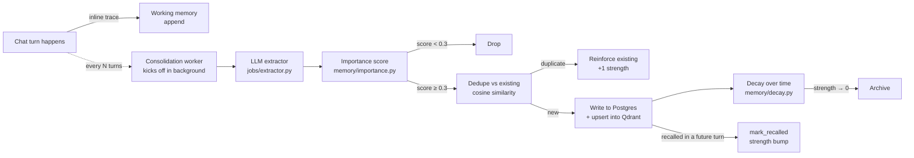

# MindMitra — How the Backend Actually Works

> **Audience.** A founder, a clinician, a designer, or a new engineer.
> No jargon, no hidden assumptions. Diagrams first, words second.

This document is the **canonical** MITRA v2 architecture narrative. The entry
[`docs/README.md`](README.md) links here, [platform.md](platform.md), and
[product.md](product.md). If a detail conflicts, **verify in code** and fix docs
in the same change.

---

## 1. The 30-second pitch

MindMitra is an AI mental-health companion for Indian youth. A user opens
the app, types or speaks a message, and gets back a warm, *personalised*
reply within ~2 seconds. Behind the scenes a single backend service runs
a five-stage pipeline that:

1. understands what the user just said,
2. checks for any safety signal (self-harm, suicide),
3. recalls the right memories about this person,
4. drafts a response using two AI passes (one fast, one careful),
5. streams the answer back word-by-word and quietly writes new memories
   in the background.

Everything else in this doc is detail on those five steps.

---

## 2. The big picture (one diagram)

```
┌─────────────┐        HTTPS / SSE         ┌────────────────────────────┐
│   Browser   │ ─────────────────────────▶ │  FastAPI (chatbotAgent)    │
│  (React)    │ ◀───────────────────────── │  /chat   /chat/stream      │
└─────────────┘   stream of text chunks    │  /chat/greeting  /transcribe│
                                            └────────────┬───────────────┘
                                                         │
                                  ┌──────────────────────┼──────────────────────┐
                                  │                      │                      │
                          ┌───────▼────────┐    ┌────────▼────────┐    ┌────────▼─────────┐
                          │  MITRA Pipeline │    │ Memory Services │    │ External LLMs    │
                          │  (one per turn) │◀──▶│  Postgres + Qdrant│◀──│ Azure / Gemini /│
                          │                 │    │                  │   │ Groq / GLM / BGE │
                          └─────────────────┘    └──────────────────┘    └──────────────────┘
                                  │
                          ┌───────▼────────────────┐
                          │ Background workers     │
                          │ • Consolidation worker │
                          │ • Reflection worker    │
                          └────────────────────────┘
```

Three things to remember from this picture:

- The browser **only ever talks to FastAPI.** Everything else is private.
- A single chat turn goes through **one** pipeline (the MITRA Pipeline).
- Memory and background work happen *next to* the pipeline — not inside
  the user's response time.

---

## 3. What lives where (the file map)

```
chatbotAgent/
├── app/
│   ├── main.py                       # FastAPI startup, request middleware, CORS
│   ├── api/
│   │   ├── chat.py                   # /chat, /chat/stream, /chat/greeting,
│   │   │                             # /chat/end-session, /transcribe
│   │   ├── health.py                 # /health, /debug/memory
│   │   ├── onboarding.py             # First-time user data capture
│   │   ├── therapist_bridge.py       # Clinician handoff
│   │   └── me_memory.py              # GET/DELETE on a user's own memories
│   ├── pipeline/
│   │   ├── crisis_fast_path.py       # 2-stage safety detector (lex + LLM)
│   │   └── mitra/
│   │       ├── orchestrator.py       # ⭐ runs ONE turn end-to-end
│   │       ├── classifier.py         # what is the user trying to do?
│   │       ├── retriever.py          # parallel memory fetch (deadlined)
│   │       ├── assembler.py          # builds the system + user prompt
│   │       ├── stance_selector.py    # tone / max-questions / disclosure rules
│   │       ├── generator.py          # two-pass draft → critique → repair
│   │       ├── dual_track.py         # optional Track-B: deeper rewrite
│   │       └── dispatch.py           # the route entry-point
│   ├── memory/
│   │   ├── episodic.py               # write/search episodic memories
│   │   ├── qdrant_v2.py              # vector store wrapper (real + in-mem fake)
│   │   ├── repositories.py           # Supabase tables (CRUD)
│   │   ├── identity_card.py          # who is this person? (single JSON doc)
│   │   ├── working.py                # short-term sliding window (last N turns)
│   │   ├── affective.py              # mood time-series
│   │   ├── relational.py             # who appears in their life (graph)
│   │   ├── procedural.py             # what coping strategies they actually use
│   │   ├── relationship_state.py     # stage: stranger → acquaintance → trusted
│   │   ├── importance.py             # 0–1 score for "should we remember this?"
│   │   ├── decay.py                  # Ebbinghaus forgetting curve
│   │   └── salience.py               # blended scoring used at retrieval
│   ├── jobs/
│   │   ├── extractor.py              # LLM extracts memory candidates from a turn
│   │   └── consolidation_worker.py   # offline: dedup + decay + reflect
│   ├── providers/
│   │   ├── azure_openai_client.py    # gpt-5-mini (primary generator)
│   │   ├── gemini_client.py          # gemini-2.5-flash (track-B + fallback)
│   │   ├── groq_client.py            # llama-3.1 8B (cheap classifier)
│   │   ├── glm_client.py             # GLM-4-32B (long-context optional)
│   │   ├── embeddings_bge.py         # local BGE-M3
│   │   └── embeddings_gemini.py      # text-embedding-004 fallback
│   ├── core/
│   │   ├── auth.py                   # Supabase JWT validation, SKIP_AUTH dev mode
│   │   ├── config.py                 # env config + model registry
│   │   ├── models.py                 # Roles → ModelConfig mapping
│   │   ├── prompts/                  # stance, critic, crisis prompts
│   │   ├── pii.py                    # redact emails / phone before logs
│   │   ├── rate_limit.py             # per-user / per-route limits
│   │   ├── telemetry.py              # OpenTelemetry spans + SLO checks
│   │   └── logging.py                # ⭐ structured logs + banner helpers
│   ├── services/
│   │   ├── supabase_service.py       # Postgres client + helpers
│   │   ├── greeting_service.py       # time-aware greeting line
│   │   ├── voice_prosody.py          # Praat-based prosody features
│   │   ├── helplines.py              # localised crisis helpline registry
│   │   └── therapist_*.py            # clinician-facing bridge
│   └── utils/                        # json, constants, small helpers
├── scripts/
│   └── eval_locomo_lite.py           # memory eval harness
└── tests/
    ├── health/                       # boot + contract checks (no live LLMs)
    └── (integration tests)           # opt-in with RUN_INTEGRATION=1
```

The two stars (⭐) are the files you will open most often:

- **`pipeline/mitra/orchestrator.py`** — the storyboard for a chat turn.
- **`core/logging.py`** — every log line in the terminal flows through here.

---

## 4. One chat turn, end-to-end

This is the single most important diagram in the codebase.

```mermaid
sequenceDiagram
  autonumber
    participant U as 👤 User (browser)
    participant API as FastAPI /chat/stream
    participant ORCH as MITRA orchestrator
    participant CLS as Classifier (Groq llama-3.1 8B)
    participant CRI as Crisis fast-path
    participant RET as Retriever (parallel)
    participant ASM as Prompt assembler
    participant GEN as Generator (Azure gpt-5-mini)
    participant CW as Consolidation worker (background)
    participant DB as Supabase + Qdrant

    U->>API: POST /chat/stream { message, session_id }
    API->>API: validate JWT, log "📥 POST /chat/stream"
    API->>ORCH: run_mitra_turn(...)

    par classify and check safety in parallel
        ORCH->>CLS: what intent + needs_memory?
        ORCH->>CRI: lexical scan; if ambiguous → LLM confirmer
    end

    alt 🚨 crisis triggered
        ORCH-->>API: localised crisis safety reply
        API-->>U: SSE chunks (helpline + grounding)
    else 🙂 normal turn
        ORCH->>RET: fetch identity_card + episodes + affect + procedural
        RET->>DB: parallel reads (deadlined ~600ms)
        ORCH->>ASM: build system + user prompt with stance constraints
        ORCH->>GEN: two-pass: draft → critic → repair (optional Track-B)
        GEN-->>API: stream chunks via stream_callback
        API-->>U: SSE chunks (sentence-buffered)
        ORCH->>DB: write turn trace + working memory append
    end

    Note over API,CW: After response, in background:
    API->>CW: every N messages → run_once_for_user
    CW->>DB: extract candidates → dedup → write episodic memories
```

### The five stages, in plain English

| # | Stage | What it does | Where it lives |
|---|---|---|---|
| 1 | **Classify + safety** | Looks at the message and asks two questions in parallel: *(a) what is the user trying to do — vent, share, ask for advice, etc.?* and *(b) is this a safety situation?* | `mitra/classifier.py` + `pipeline/crisis_fast_path.py` |
| 2 | **Crisis short-circuit** | If safety says *hard*, stop everything. Reply with the localised helpline + grounding script. **No memory reads, no LLM generation.** | `pipeline/crisis_fast_path.py` |
| 3 | **Retrieve** | Pull only what the next prompt actually needs: who this person is (identity card), their last few highly-relevant memories, their recent mood pattern, what coping moves have worked before. All four reads run **in parallel**, with a hard ~600 ms deadline. | `mitra/retriever.py` + `memory/*` |
| 4 | **Assemble + stance** | Build a system prompt that says "you are Mitra, this user is X, here are 3 relevant memories, your tone today is *holding* not *advising*, ask at most 1 question". | `mitra/assembler.py` + `mitra/stance_selector.py` |
| 5 | **Generate** | First pass writes a draft. A tiny *critic* checks for style violations (too long, too clinical, too many questions, missed grounding…). If anything fails, the model rewrites. The critic is bounded — at most 1 repair pass on the hot path. | `mitra/generator.py`, optional `mitra/dual_track.py` |

After the response is sent, two background things happen so the user
never waits for them:

- **Consolidation worker** (`jobs/consolidation_worker.py`) extracts new
  memory candidates from the last few turns, dedupes against existing
  memories, scores them with `importance.py`, and writes the survivors
  to Postgres + Qdrant.
- **Reflection** (also in the worker) every few sessions writes a
  cross-session insight ("they cope better when their sister is around").

---

## 5. The brains: which model does what

Different jobs need different models. The mapping lives in
`core/models.py` and is the single source of truth.

| Role | Model | Provider | Why this one |
|---|---|---|---|
| **Classifier** (intent + needs-memory) | `llama-3.1-8b-instant` | Groq | Fast, cheap, structured-output friendly |
| **Crisis confirmer** (LLM second-stage) | `gemini-2.5-flash` | Gemini | Low latency, multilingual |
| **Generator (primary)** | `gpt-5-mini` | Azure OpenAI | Best instruction-following + true streaming |
| **Generator (Track B / fallback)** | `gemini-2.5-flash` | Gemini | Long context, cheaper rewrite path |
| **Long-context** (only when prompt > 32k) | `glm-4-32b-0414-128k` | Z.AI | Cheap 128k window |
| **Memory extractor** (offline) | `llama-3.1-8b-instant` | Groq | Cheap; runs in background |
| **Embeddings (primary)** | `BGE-M3` | local | Multilingual, no per-call cost |
| **Embeddings (fallback)** | `text-embedding-004` | Gemini | Drop-in if BGE host is down |
| **Speech-to-text** | `whisper-large-v3-turbo` | Groq | Cheap fallback when Azure STT returns empty |

If you swap a model, change exactly one row in `core/models.py`. The
pipeline picks it up on the next startup.

---

## 6. Memory: how Mitra "remembers" you

Memory is the hardest part to explain, so we use a simple metaphor: **a
notebook, a journal, and a habit log.**

```
┌─────────────────────────────────────────────────────────────────────┐
│                        Per-user memory model                        │
├──────────────┬──────────────────────────────────────────────────────┤
│ Identity card│ One short JSON: name, pronouns, languages, key       │
│ (the cover)  │ relationships, soft preferences. Read every turn.    │
├──────────────┼──────────────────────────────────────────────────────┤
│ Episodic     │ Up to a few hundred short "moments" per user.        │
│ (the journal)│ Each has: summary, importance, mood (V-A-D), tags,   │
│              │ embedding. Lives in Postgres + Qdrant.               │
├──────────────┼──────────────────────────────────────────────────────┤
│ Affective    │ Time-series of mood scores over the last N days.     │
│ (the mood    │ Used to detect patterns ("worse on Sundays").        │
│  graph)      │                                                      │
├──────────────┼──────────────────────────────────────────────────────┤
│ Relational   │ Tiny graph: people in the user's life, their roles.  │
│ (who's who)  │ Stops Mitra from confusing "didi" with "boss".       │
├──────────────┼──────────────────────────────────────────────────────┤
│ Procedural   │ Coping strategies that the user has tried + worked.  │
│ (the habit   │ Used by the assembler to suggest things they already │
│  log)        │ trust.                                                │
├──────────────┼──────────────────────────────────────────────────────┤
│ Working      │ A sliding window of the last few turns of THIS chat. │
│ (scratchpad) │ In-process; flushed at session end.                  │
├──────────────┼──────────────────────────────────────────────────────┤
│ Relationship │ A single label per user: stranger → acquaintance →   │
│ state        │ trusted → close. Controls how much self-disclosure   │
│              │ the assistant offers.                                │
└──────────────┴──────────────────────────────────────────────────────┘
```

### How a memory is born and how it dies



Two things to internalise:

- **Memories get stronger every time we use them.** Recall = reinforcement.
- **Memories that are never recalled fade.** This is by design — it
  prevents the database from drowning the model in stale context.

---

## 7. Safety: the crisis fast-path

Safety is the only stage that is allowed to **skip the rest of the
pipeline**. If anything looks like self-harm or acute suicidal ideation,
we never run the generator.

```
┌──────────────────────────┐
│ User message arrives     │
└──────────────┬───────────┘
               │
               ▼
┌──────────────────────────┐
│ Stage 1 — lexical scan   │  multilingual phrases, regex,
│ (instant, no network)    │  romanised Hindi included
└──────┬────────────┬──────┘
       │ safe       │ ambiguous          │ hard
       ▼            ▼                    ▼
   continue     Stage 2 — Gemini     CRISIS FAST-PATH
   pipeline    confirmer (≤ 600ms)   • play helpline message
                    │                  • do grounding script
                    ▼                  • log crisis_event
              triggered? ──── yes ──▶  • return immediately
                    │
                    ▼
                  no → continue pipeline
```

Notes:

- The lexical list is hand-curated, multilingual, and intentionally
  *over*-flags. The LLM second stage cleans up false positives.
- The fast-path **never** waits on memory or generation.
- Every trigger writes a row to `crisis_events` for audit + clinician
  follow-up.

---

## 8. Streaming: how the words actually reach the browser

The chat UI is the part most likely to feel broken if a single piece
of plumbing is wrong, so this section is precise.

```
Provider (Azure / Gemini)
        │  yields text deltas
        ▼
azure_openai_client._complete_stream
   • producer runs in a worker thread
   • puts deltas into asyncio.Queue
   • CRITICAL: producer is fire-and-forget
     (asyncio.create_task, NOT awaited)
        │
        ▼
mitra/dispatch._make_llm_caller
   • async-iterates the queue
   • calls stream_callback(delta) for each chunk
        │
        ▼
api/chat.py event_generator
   • on_chunk pushes into another asyncio.Queue
     (loop.call_soon_threadsafe — thread safe)
   • main loop reads queue, buffers until a
     sentence boundary, then yields:
       event: text_chunk_delta
       data: {"chunk": "..."}\n\n
        │
        ▼
Browser EventSource
   • parses each `data:` line as JSON
   • appends `chunk` to the live message bubble
```

If you ever see "the response only appears at the end", the bug is
almost certainly in step 2 — someone re-introduced an `await` before
the producer task. The fix is `asyncio.create_task(asyncio.to_thread(...))`,
never `await asyncio.to_thread(...)`.

---

## 9. Logging: what you should see in the terminal

Every important step in the backend now prints a coloured banner or a
single-line stage marker. A healthy chat turn produces logs like:

```
2026-04-20 14:01:12 [INFO] app.api.chat req=ab12 ─── 📥 POST /chat/stream
                                                      user        : a0778b19
                                                      session     : 9f3d
                                                      persona     : mitra
                                                      language    : en
                                                      avatar      : True
                                                      msg_len     : 47 chars
2026-04-20 14:01:12 [INFO] app.mitra   req=ab12 ─── 🧠 MITRA TURN START
                                                      ...
2026-04-20 14:01:12 [INFO] app.mitra   req=ab12 [STAGE] classify+safety intent=vent safety=safe crisis=False dur_ms=180
2026-04-20 14:01:12 [INFO] app.mitra   req=ab12 [STAGE] retrieve_memories episodes=4 identity_card=True affect=low_mood dur_ms=210
2026-04-20 14:01:12 [INFO] app.mitra   req=ab12 [STAGE] select_stance stance=holding max_q=1
2026-04-20 14:01:13 [INFO] app.mitra   req=ab12 [STAGE] assemble_prompt sys_chars=2310 user_chars=412 episodes_used=3 dur_ms=8
2026-04-20 14:01:13 [INFO] app.mitra   req=ab12 [STAGE] generate_response generator=TwoPassGenerator stream=True
2026-04-20 14:01:14 [INFO] app.mitra   req=ab12 [STAGE] generate_done chars=312 accepted_on_pass=1 fallback=False dur_ms=1100
2026-04-20 14:01:14 [INFO] app.mitra   req=ab12 ─── ✅ MITRA TURN COMPLETE
                                                      intent      : vent
                                                      stance      : holding
                                                      chars       : 312
                                                      episodes    : 3
                                                      accepted_on : pass 1
                                                      fallback    : False
                                                      timings_ms  : classify_ms=180 retrieve_ms=210 assemble_ms=8 generate_ms=1100 total_ms=1500
2026-04-20 14:01:15 [INFO] app.api.chat req=ab12 🧪 [CONSOLIDATE] user=a0778b19 candidates=2 written=1 archived=0 reflections=0
```

Three things make this useful in production:

- **`req=` correlation id** — every log line in one HTTP turn shares the
  same request id (set by middleware in `main.py`, propagated via
  `ContextVar` and `bind_request_context`).
- **Banner + stage style** — banners frame the start/end of a unit of
  work; stages are dense single-line markers between them.
- **Background threads inherit context.** Use `spawn_correlated_thread`
  (from `core/logging.py`) instead of `threading.Thread` directly — the
  consolidation worker uses this so its logs still carry `req=`.

Set `LOG_FORMAT=json` in production to get structured JSON instead of
the colour banners — same fields, different renderer.

---

## 10. Configuration & feature flags

| Variable | Effect | Default |
|---|---|---|
| `MITRA_STACK_ENABLED` | Master switch. If off, `/chat` returns 503. | `1` (on) |
| `MITRA_CRISIS_V2_ENABLED` | Use the 2-stage crisis detector. | `1` |
| `MITRA_DUAL_TRACK_ENABLED` | Run optional Track-B rewrite for tougher turns. | `0` |
| `MITRA_CONSOLIDATION_INTERVAL` | Run consolidation every N user turns. | `12` |
| `LOG_LEVEL` | INFO / DEBUG / WARNING. | `INFO` |
| `LOG_FORMAT` | `colour` (dev) or `json` (prod). | `colour` |
| `SKIP_AUTH` | Dev only. Replaces JWT validation with `DEV_USER_ID`. | unset |
| `QDRANT_HOST` / `QDRANT_PORT` | Vector store. Falls back to in-memory if missing. | `localhost:6333` |
| `SUPABASE_URL` / `SUPABASE_SERVICE_ROLE_KEY` | Postgres + auth. | required in prod |

The full list lives in `chatbotAgent/.env.example`.

---

## 11. Common questions

**Q: Where do I add a new "intent"?**
`mitra/classifier.py` defines `Intent`. Add the value, update the
classifier prompt, and decide in `stance_selector.py` what stance + max
questions that intent should trigger.

**Q: Why are there *two* "generators"?**
The default is `TwoPassGenerator` — one draft, one critic, optional
repair. The richer `DualTrackGenerator` runs an additional Track-B
rewrite for emotionally heavy turns. Both implement the same `generate()`
interface so the orchestrator doesn't care which is wired.

**Q: How do I disable memory entirely for a test?**
Pass an in-memory Qdrant (`InMemoryQdrant` from `memory/qdrant_v2.py`)
and a no-op `EpisodicRepo`. The retriever degrades gracefully — empty
context is fine.

**Q: What happens if Azure / Gemini is down?**
The provider raises; the orchestrator catches and returns a soft
fallback message *and* logs `fallback=True`. The critic also has a
"soft fallback" template it can return without an LLM call.

**Q: Why isn't there a `workflow.py` any more?**
There used to be a legacy linear pipeline. It was deleted in this
migration. All chat now flows through `pipeline/mitra/`.

---

## 12. Where to read next

- `docs/platform.md` — memory v2 modules, Qdrant, pipeline, runbook.
- `docs/EVALUATION.md` — how we test (pytest + LOCOMO-lite + LLM judge).
- `docs/api_contracts.md` — every HTTP endpoint, request, response.
- `docs/product.md` — MindGym, therapist bridge, analytics, security headers.
- `chatbotAgent/app/pipeline/mitra/orchestrator.py` — when in doubt,
  read the orchestrator. It is intentionally short.

---

## 13. Future Work

This section documents deferred improvements with concrete recipes.
Anyone picking these up should be able to ship them in one PR.

### 13.1 Re-enabling voice prosody (Praat / parselmouth)

Prosody analysis is **OFF** on the chat path (April 2026). The LLM never
consumed the features and `import parselmouth` has hung the FastAPI
lifespan under macOS Gatekeeper while holding the GIL. The synchronous
analyser still lives in `app/services/voice_prosody.py` for offline jobs.

When you actually want the LLM to see acoustic features, follow this
3-step recipe — never call `analyze_prosody` from an async handler:

1. **Carry the field through the pipeline.** Add a `prosody:
   Optional[Dict[str, Any]]` field to `TurnInput`
   (`app/pipeline/mitra/orchestrator.py`) so the structured features
   reach the assembler.
2. **Render it into the system prompt.** Add a small block in the
   assembler (`app/pipeline/mitra/assembler.py`) that, when `prosody` is
   present, calls
   `from app.services.voice_prosody import format_prosody_for_prompt`
   and inlines the resulting block under a `## Acoustic context`
   heading. Keep it short — one paragraph.
3. **Extract Praat in a sandboxed subprocess.** Create
   `app/tools/prosody_cli.py` that reads a base64 WAV from stdin, runs
   `analyze_prosody`, and writes JSON to stdout. From the chat endpoint:
   `subprocess.run(["python", "-m", "app.tools.prosody_cli"], input=wav_b64,
   capture_output=True, text=True, timeout=4)`. If the timeout fires you
   kill the subprocess — the FastAPI process is unaffected.

Also re-enable the dependency: uncomment `praat-parselmouth==0.4.7` in
`chatbotAgent/requirements.txt` and re-add the `audio_data` field to the
frontend POST in `src/components/chat/ChatGPTInterface.tsx`.

### 13.2 First-byte SLO

The backend now forwards every provider delta straight to the SSE
stream — no sentence-boundary buffer (`app/api/chat.py event_generator`).
First audible byte should land within **~1.5 s** of the request reaching
the orchestrator on a healthy Azure connection.

If you ever re-introduce server-side buffering (sentence batching, JSON
chunking, etc.), gate it behind a feature flag and document the
trade-off here. Frontend Presence mode already does its own
Unicode-aware sentence segmentation in
`src/components/chat/ChatGPTInterface.tsx` (`COMPLETED_SENTENCES_RE`).

### 13.3 Production deployment checklist

- `SKIP_AUTH=0` — the dev override bypasses Supabase JWT validation.
- Multi-worker uvicorn:
  `uvicorn app.main:app --workers 4 --worker-class uvicorn.workers.UvicornWorker`.
- Wire `app/core/rate_limit.py` into the chat router (currently defined
  but not enforced).
- Apply the `mitra_turn_traces` schema migration so `accepted_on_pass`,
  `fallback_used`, `stance`, `callback_budget`, `critic`, `used_episodes`
  exist as real columns. The repository's schema-drift fallback then
  becomes a no-op (no warning, no JSON demotion).
- Set `OTEL_SERVICE_NAME` so spans aren't no-op.
- Validate Gemini quota and consider flipping
  `MITRA_DUAL_TRACK_ENABLED=1` for parallel speculative generation.
- Pick a faster `GENERATOR_PRIMARY` model if `gpt-5-mini` p95 latency
  remains > 3 s — `gpt-4o-mini` and Groq Llama-3.1-70B are reasonable
  candidates with their own quality bake-offs.

### 13.4 Architectural rule — native libs and the request hot path

Never `import` a native-code library at module top-level inside a route
handler, the FastAPI `lifespan`, or any code path reachable from an
async request. Native dynamic loaders (dyld on macOS, ld-linux on
Linux) can stall on signature checks, license probes, or model-file
downloads while holding the GIL — and a single stalled import freezes
the entire ASGI process.

If you must use such a library:

- Wrap it in a CLI subprocess called via `subprocess.run(..., timeout=N)`
  so a hang can be killed without taking down the server.
- Or run it in a one-shot worker (`spawn_correlated_thread`,
  `concurrent.futures.ProcessPoolExecutor`) gated by a hard timeout and
  a circuit breaker.
- Or push it entirely off-line into a job (`app/jobs/`) that the chat
  path never awaits.

This rule is what got broken when prosody was inlined into the chat
endpoint. Treat any new native dependency (Whisper, faiss, llama-cpp,
sentence-transformers, etc.) the same way.

---

*Last revised: April 2026. If anything in this doc disagrees with the
code, the code is right — please update this file in the same PR.*
