# MindMitra v2 — Visual Architecture Atlas

> A teaching-grade reference for the MITRA stack we shipped across Phases 0 → 6.
> Every number, model name, threshold and budget below is pulled directly from the
> code at `chatbotAgent/app/`. Use this doc as your single map of the system.

---

## 0. TL;DR — One-Page Cheat Sheet

| Layer | Component | Concrete pick | Why this pick |
|---|---|---|---|
| **Classifier** | `IntentClassifier` (regex) | _no LLM_ | <1 ms, deterministic, hot path |
| **Crisis lex** | `crisis_fast_path.classify_lexical` | EN + Devanagari + Romanised Hi | C-SSRS aligned |
| **Crisis confirm** | `Role.CRISIS_CONFIRMER` | **Groq Llama-3.1-8B-Instant** (≤6s) | only ambiguous cases |
| **Importance gate** | `Role.IMPORTANCE_SCORER` | Groq Llama-3.1-8B (heuristic + LLM) | 100ms write-time gate |
| **Embeddings** | `Role.EMBEDDINGS` | **BAAI/bge-m3** (1024-d, local) | multilingual EN/HI/Hinglish |
| **Embeddings backup** | `Role.EMBEDDINGS_FALLBACK` | Gemini `text-embedding-004` (768-d) | cloud fallback |
| **Generator (primary)** | `Role.GENERATOR_PRIMARY` | **Azure OpenAI `gpt-5-mini`** (T=0.7, 900 tok) | quality + grounded |
| **Generator (specul.)** | `Role.GENERATOR_SPECULATIVE` | Gemini 2.5 Flash | first-token latency |
| **Generator (backup)** | `Role.GENERATOR_BACKUP` | Z.AI **GLM-4-32B-0414-128k** | cross-provider failover |
| **Critic** | `Role.CRITIC` (regex + Llama 8B) | Groq Llama-3.1-8B | 5-rubric, deterministic |
| **Extractor** | `Role.EXTRACTOR` | Gemini 2.5 Flash (long ctx) | session-end memory |
| **Reflection** | `Role.REFLECTION` | Gemini 2.5 Flash | nightly synthesis |
| **ASR** | `Role.ASR` | Groq **Whisper-large-v3-turbo** | <2s for 30s audio |
| **Vector store** | Qdrant `mitra_episodic_v2` + `mitra_reflections_v2` | 1024-d, cosine | self-host, fast |
| **Structured store** | Supabase Postgres (RLS on every user table) | 11 new tables | multi-tenant, secure |

**Per-turn budget**

```
classify    1ms     ▏
crisis lex  3ms     ▏▏
retrieve   ≤250 ms  ▏▏▏▏▏▏▏▏▏▏▏▏▏    (parallel, deadlined)
assemble    5ms     ▏
generate   ≤2.5 s   ▏▏▏▏▏▏▏▏▏▏▏▏▏▏▏▏▏▏▏▏▏▏▏▏▏▏▏▏▏▏▏▏▏▏▏▏▏▏▏▏▏
critic +   ≤300 ms  ▏▏▏▏▏▏▏▏▏▏▏▏▏▏▏  (regex; LLM only on REJECT)
revise     ≤1.5 s   ▏▏▏▏▏▏▏▏▏▏▏▏▏▏▏▏▏▏▏▏▏▏▏▏▏  (only if critic asked)
trace +    1ms      ▏
working-mem write
─────────
total p50  ~2.6 s   target. Crisis path bypasses generator → ~80 ms.
```

**Memory budget at retrieval (per turn)**

```
identity_card   1   ─── always loaded (~150 chars)
episodes        ≤6  ─── top-k from Qdrant after composite re-rank
affect_pattern  ≤1  ─── only if ≥2 channels agree (lexical / acoustic / self-report)
related ents.   ≤8  ─── parallel to episodic, stops on deadline
procedural rec. ≤1  ─── only when intent == seek_advice
─────────────────────
char budget per Stage:
  Stranger       600   chars  (≤1 question per turn,  ≤3 per 5-turn window)
  Acquaintance  1100   chars  (1 / 3)
  Familiar      1700   chars  (2 / 5)
  Trusted       2400   chars  (2 / 6)
```

**Feature flag** = `MITRA_STACK_ENABLED=1` flips `/chat` from legacy to MITRA.

---

## 1. System Landscape

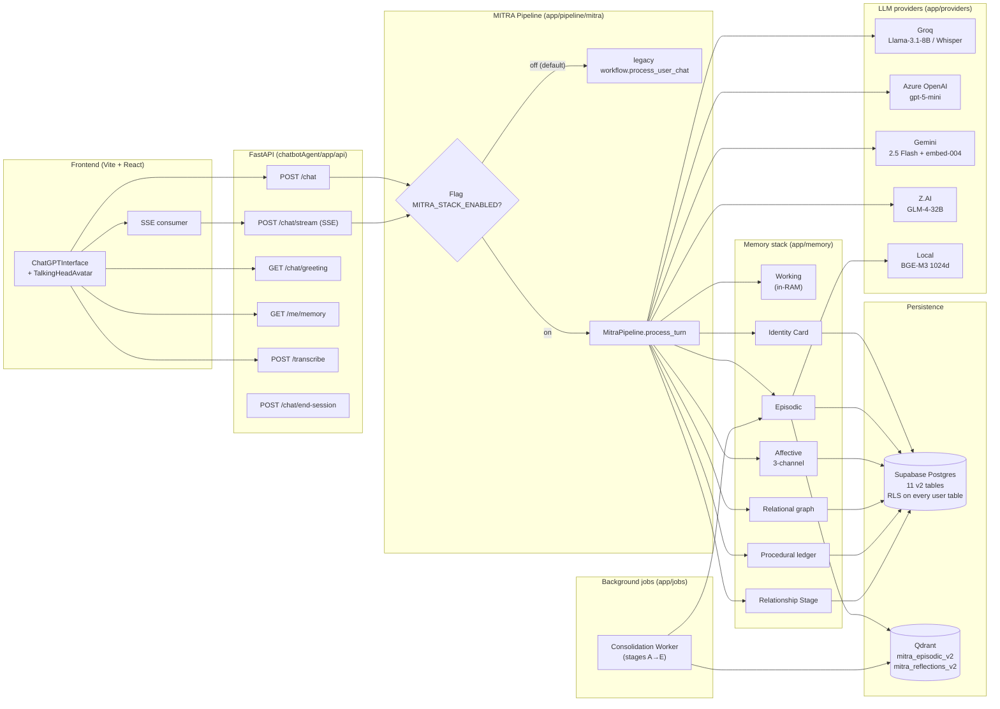

---

## 2. Per-Turn Pipeline (the heart)

```mermaid
flowchart TD
  START(["user_message arrives<br/>POST /chat or /chat/stream"]) --> AUTH["validate_user_token<br/>(Supabase JWT)"]
  AUTH --> PREWARM["Prewarm: emotional trend cache<br/>(daemon thread)"]
  PREWARM --> FLAG{"MITRA_STACK_ENABLED?"}
  FLAG -- off --> L0["legacy process_user_chat"]
  FLAG -- on  --> P0["MitraPipeline.process_turn"]

  P0 --> P1["1. IntentClassifier.classify<br/>regex EN + Hinglish<br/>≤1 ms"]
  P1 --> P2{"safety_signal == hard?<br/>(or crisis_fast_path classify_lexical)"}
  P2 -- yes --> CRISIS["build_crisis_response<br/>(template + helplines)<br/>~3 ms"]
  CRISIS --> TRACE_C["TurnTraceRepo.insert<br/>(is_crisis=true)"]
  TRACE_C --> RET_C(["return TurnResult<br/>modality=crisis<br/>confidence=1.0"])

  P2 -- no --> P3["2. RetrieverOrchestrator.fetch<br/>parallel asyncio.wait, deadline=250ms"]

  subgraph P3SUB["fan-out (5 channels)"]
    direction LR
    P3a["Identity Card"]
    P3b["Episodic top-k=6<br/>BGE-M3 + Qdrant"]
    P3c["Affective pattern<br/>3-channel agreement"]
    P3d["Related entities"]
    P3e["Procedural rec.<br/>(only if intent==seek_advice)"]
  end
  P3 --> P3SUB --> P4["3. ContextAssembler.assemble<br/>budget by Stage<br/>600..2400 chars"]

  P4 --> P5["4. TwoPassGenerator.generate<br/>system + user prompt → LLM"]

  P5 --> DRAFT["Pass-1 Draft<br/>Azure gpt-5-mini<br/>T=0.7, 900 tok"]
  DRAFT --> CRITIC["critique() v0+v1<br/>regex + windowed Q-budget"]
  CRITIC --> V{"verdict?"}
  V -- ACCEPT --> EMIT["use draft"]
  V -- SOFT_REWRITE --> REVISE["Pass-2 with rewrite hint<br/>same model, no streaming"]
  V -- REJECT --> REVISE
  REVISE --> CRITIC2["critique again"]
  CRITIC2 --> V2{"verdict?"}
  V2 -- ACCEPT/SOFT --> EMIT_R["use revision"]
  V2 -- REJECT --> FALLBACK["Pass-3 deterministic<br/>safe message<br/>fallback_used=true"]

  EMIT --> P6["5. TurnTraceRepo.insert<br/>(intent, timings, used_episodes,<br/>accepted_on_pass)"]
  EMIT_R --> P6
  FALLBACK --> P6
  P6 --> P7["6. WorkingMemoryStore.append_turn<br/>(user + assistant)"]
  P7 --> RET(["return TurnResult"])

  L0 --> RET_LEG(["legacy result"])
```

**Key invariants in the diagram**

* Every box on the right of the deadline line is **best-effort** — anything that
  doesn't return in 250 ms is dropped, not awaited. Set in `RetrieverOrchestrator(deadline_ms=...)`.
* Pass-2 (revision) is **never streamed** — we don't want clients to receive two
  overlapping SSE streams. See `generator.py::_REJECT_FALLBACK`.
* If both passes fail the critic, we emit a hand-crafted safe message and mark
  `fallback_used=true` in the trace so SREs can alert on this.

---

## 3. Crisis Fast-Path (zoomed in)

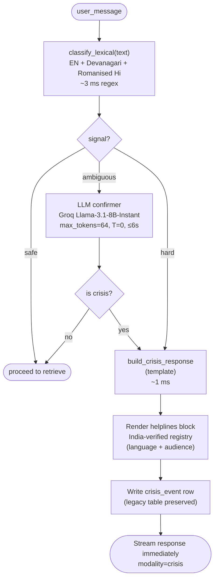

**Lexicons** live in `app/pipeline/crisis_fast_path.py`:

| Pattern set | Examples | Action |
|---|---|---|
| `_HARD_EN` | "kill myself", "end my life", "suicide" | → `hard` |
| `_HARD_DEVANAGARI` | "खुदकुशी", "जान देना" | → `hard` |
| `_HARD_ROMAN_HI` | "jaan de du", "khudkushi" | → `hard` |
| `_AMBIGUOUS` | "can't go on", "no point" | → LLM confirm |
| `_BENIGN_GUARDS` | "die laughing", "killing me lol" | → `safe` (false-positive guard) |

**Helpline registry** = `app/services/helplines.py`. Verified India-first numbers
(iCall, Vandrevala, AASRA, KIRAN), filtered by `language ∈ {en, hi, hinglish}`
and `audience ∈ {all, lgbtq, students, women}`.

---

## 4. Memory Subsystem (the 7 stores)

```mermaid
flowchart LR
  subgraph SHORT["short-term"]
    WM["Working memory<br/>app/memory/working.py<br/>per-session ring buffer<br/>RAM only"]
  end

  subgraph LONG["long-term, structured"]
    IC["Identity Card<br/>1 row per user<br/>preferred_name, pronouns,<br/>languages, identities,<br/>boundaries, provenance"]
    AF["Affective ts<br/>3 channels:<br/>lexical / acoustic / self_report<br/>composite PK<br/>(user, date, kind, channel)"]
    REL["Entities + edges<br/>kind ∈ {person, place,<br/>concept, event}<br/>aliases auto-merged"]
    PROC["Procedural ledger<br/>intervention × pre/post valence<br/>used to recommend<br/>'what helped before'"]
    RS["Relationship state<br/>Stage + counters<br/>session_count, total_minutes,<br/>topic_breadth, repairs"]
  end

  subgraph LONG_V["long-term, vector"]
    EP["Episodic memories<br/>summary embedded by BGE-M3<br/>(1024-d cosine in Qdrant)<br/>+ verbatim + affect_vad<br/>+ themes + importance + strength"]
    REF["Reflection insights<br/>(Phase 4 nightly)"]
  end

  TURN["per-turn"] --> WM
  TURN --> AF
  TURN -.write-time gate.-> IC
  TURN -.importance ≥ 0.55.-> EP
  TURN --> REL
  CON["consolidation"] --> EP
  CON --> REF
  CON --> AF
```

### 4.1 Postgres tables (Mitra v2 only — legacy preserved)

| Table | Purpose | Key columns |
|---|---|---|
| `mitra_identity_cards` | Stable self-concept | `preferred_name, pronouns, languages, stated_identities[], values_facets[], cultural_context jsonb, field_provenance jsonb` |
| `mitra_episodic_memories` | Specific moments | `summary, verbatim_quote, qdrant_id, affect_vad, themes[], importance, strength, last_recalled_at, archived_at` |
| `mitra_affect_timeseries` | 3-channel mood | composite PK `(user_id, bucket_date, bucket_kind, channel)` + `acoustic_features jsonb, self_report_scores jsonb` |
| `mitra_entities` | Things in the user's life | `kind, display_name, aliases[]` |
| `mitra_entity_edges` | Relationships | `src_id, dst_id, edge_type, weight` |
| `mitra_procedural_ledger` | Intervention × outcome | `intervention, pre_valence, post_valence, context jsonb` |
| `mitra_relationship_state` | Stage + counters | `stage, session_count, total_minutes, topic_breadth, successful_repairs, last_promoted_at` |
| `mitra_reflection_insights` | Higher-order patterns | `qdrant_id, theme, supporting_episode_ids[]` |
| `mitra_turn_traces` | Per-turn observability | `intent, safety_signal, is_crisis, response_chars, accepted_on_pass, timings_ms jsonb` |
| `mitra_consolidation_queue` | Async work backlog | `payload jsonb, attempts, locked_until` |
| `mitra_legacy_migration_map` | Backfill bookkeeping | `legacy_id, legacy_table, mitra_id, mitra_table` |

RLS = enabled on every user-scoped table. Service role bypasses for backend writes.

### 4.2 Read paths at retrieval

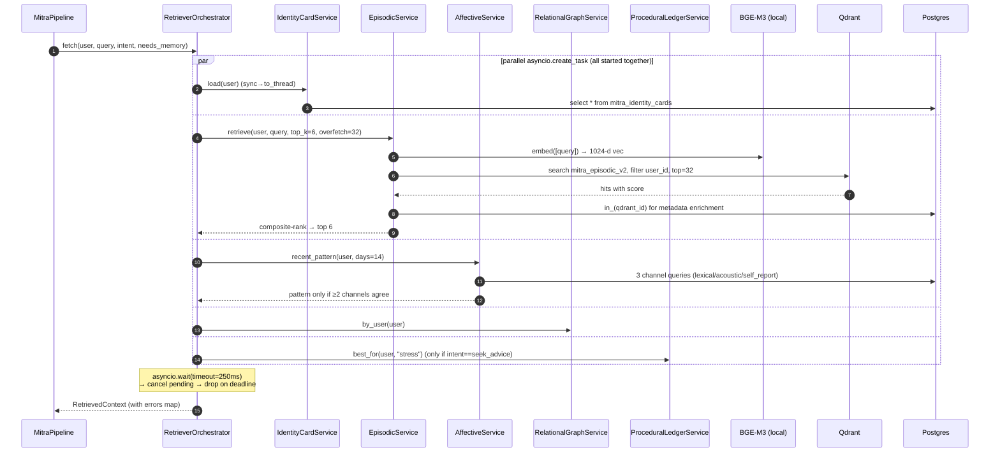

**Composite ranking** in `episodic.retrieve()`:

```
score = dense_cosine
      × (0.5 + 0.5 × importance)     # important memories rank higher
      × (0.4 + 0.6 × strength)       # decayed memories sink
```

### 4.3 Write paths after a turn

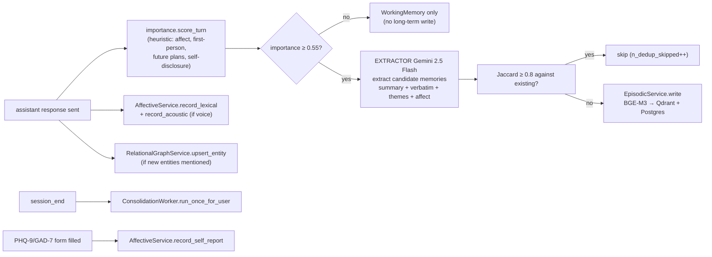

---

## 5. Two-Pass Generator + Critic Loop

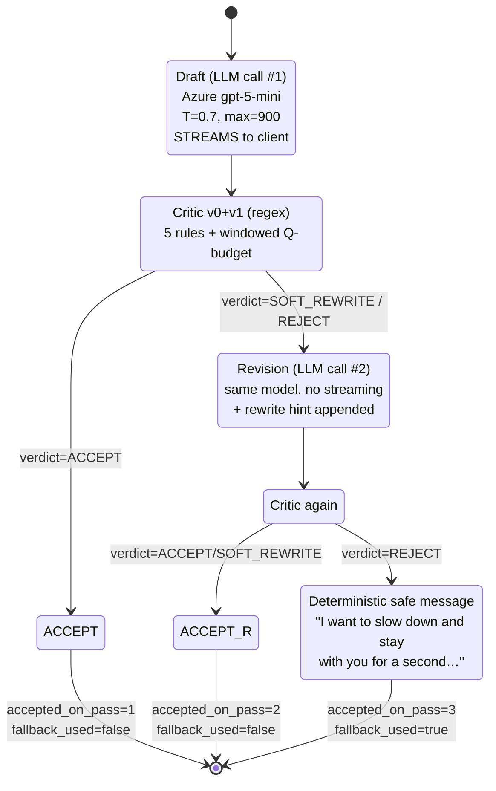

### 5.1 Critic rule book (`app/core/prompts/critic.py`)

| ID | Rule | Detector | Severity |
|---|---|---|---|
| R1 | Sycophancy | regex: "great question", "you're absolutely right", "I'm so proud of" | WARN → SOFT_REWRITE |
| R2 | False emotion | regex: "I'm sad too", "I feel your pain", "I'm hurt" | BLOCK → REJECT |
| R3 | Premature advice | when intent=`vent` and draft contains "you should…" | WARN → SOFT_REWRITE |
| R4 | Memory hallucination | claims of past detail not in `retrieved_summaries` | BLOCK → REJECT |
| R5 | Question budget (per-turn) | `?` count > Stage cap | WARN → SOFT_REWRITE |
| R6 | Question budget (windowed) | `prior_questions_in_window + this_turn > Stage window cap` | WARN → SOFT_REWRITE |

**Question budget per Stage** (`app/core/prompts/stance.py::_QUESTION_BUDGET`)

| Stage | per-turn | per-5-turn-window |
|---|---|---|
| Stranger | 1 | 3 |
| Acquaintance | 1 | 3 |
| Familiar | 2 | 5 |
| Trusted | 2 | 6 |

---

## 6. Reflective Consolidation Worker (offline)

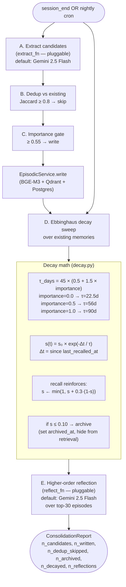

### Why this design

* **Decay τ scales with importance** — life-changing memories last 6× longer
  than trivia. Tuned so a `importance=0.5` memory loses ~50% strength in 30
  days if never recalled (modeling normal forgetting).
* **Recall reinforces** — every retrieval that surfaces a memory bumps its
  strength back toward 1.0 (testing-effect / spaced repetition).
* **Archive, never delete** — `archived_at` is set; row is hidden from
  retrieval but kept for audit, "do you remember", and future re-activation.

---

## 7. Relationship Stage State Machine

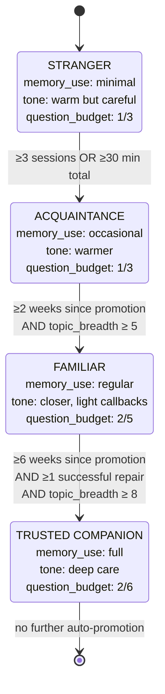

**Advance-only.** Stage downgrades require an explicit ops command
(`force_set_stage`). Hybrid counter pattern (DB = source of truth across
sessions, RAM delta wins inside a session) lives in
`RelationshipStateService.get()` / `record_session_end()`.

---

## 8. Provider Routing & Fallback Chain

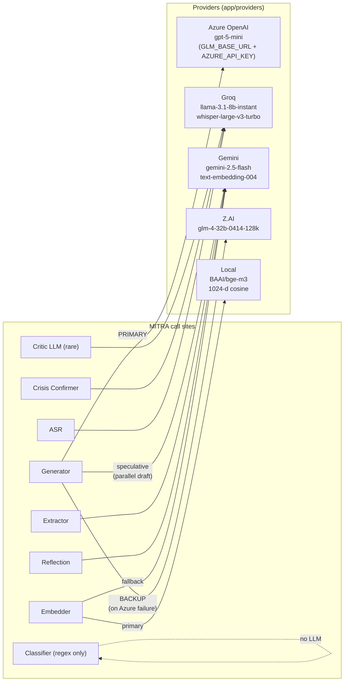

**Fallback wiring** (`app/providers/base.py::_FallbackLLMProvider`)

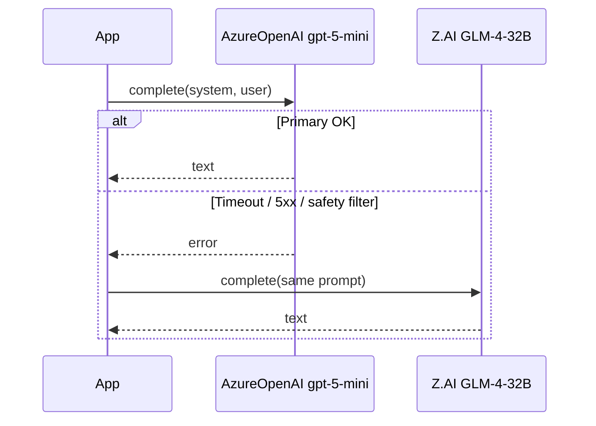

The `with_fallback(...)` helper composes any two providers into one
`BaseLLMProvider`, so the dispatch layer can swap chains without code
changes — set `MM_MODEL_GENERATOR_PRIMARY=glm:glm-4-32b-0414-128k` to flip
provider per deploy.

---

## 9. Prompt Assembly (what the LLM actually sees)

```
┌─ SYSTEM ────────────────────────────────────────────────────────────────────┐
│ # Role                                                                      │
│ You are MindMitra — a culturally-aware mental-wellness companion …          │
│                                                                             │
│ # Persona                                                                   │
│ Voice: warm, attentive friend; calm, present …  ← from ctx.persona          │
│                                                                             │
│ # Therapeutic Stance (non-negotiable)                                       │
│ - Carl Rogers' core conditions: UPR, empathic understanding, congruence     │
│ - Lead with reflection BEFORE any suggestion …                              │
│                                                                             │
│ # Relationship Stage: FAMILIAR                                              │
│ {stage-specific guidance: memory use, tone, callback style}                 │
│                                                                             │
│ # Question Budget (anti-interrogation guard)                                │
│ - At most 2 questions per turn.                                             │
│ - At most 5 questions across the last 5 turns.                              │
│                                                                             │
│ # Language                                                                  │
│ Respond in natural Hinglish — code-mix English and Romanised Hindi …        │
│                                                                             │
│ # Identity                                                                  │
│ The user prefers to be called Aman. Use it sparingly.                       │
│                                                                             │
│ # Response shape                                                            │
│ - 2–6 sentences typical. Mirror register and rhythm.                        │
│ - End with either a soft reflection or (within budget) one open question.   │
│                                                                             │
│ # Hard rules                                                                │
│ - Never claim to feel emotions you don't have.                              │
│ - Never fabricate memories. If you don't know, say you don't know.          │
└─────────────────────────────────────────────────────────────────────────────┘
┌─ USER ──────────────────────────────────────────────────────────────────────┐
│ WHO THEY ARE                                                                │
│ User goes by: Aman                                                          │
│ Pronouns: he/him                                                            │
│ Languages: en, hinglish                                                     │
│ Self-described: 2nd-year CS student; lives in Pune                          │
│                                                                             │
│ RECENT EMOTIONAL TREND                                                      │
│ Low-mood trend across last 9 days (lexical + acoustic agree, conf 0.74)     │
│                                                                             │
│ RELEVANT MEMORIES                                                           │
│ - (2026-04-10) [anxious] Talked about end-sem exams next month.             │
│ - (2026-04-04) [calm]    Going on bike rides clears his head.               │
│ - (2026-03-28) [low]     Dad's expectations weigh heavily.                  │
│ - (2026-03-22) [hopeful] Joined a study group for DSA.                      │
│ - (2026-03-15) [anxious] Internship rejection from Razorpay.                │
│   ⌐ truncated to 5/6 — char budget for FAMILIAR stage = 1700                │
│                                                                             │
│ WHAT HELPED THEM BEFORE                                                     │
│ - 4-7-8 breathing (avg valence delta +0.38)                                 │
│                                                                             │
│ RECENT CONVERSATION                                                         │
│ USER:  yaar college ka pressure bahut zyada hai                             │
│ MITRA: that sounds heavy. what's heaviest right now?                        │
│ USER:  ghar pe sab bahut expect karte hain                                  │
│                                                                             │
│ CURRENT MESSAGE                                                             │
│ USER: aaj fir se rona aa raha hai                                           │
└─────────────────────────────────────────────────────────────────────────────┘
```

Budgets and ordering are in `assembler.py::_BUDGETS` and `_render_memory()`.
Identity Card always wins; episodes are added in rank order until the budget
is exhausted; truncation is silent (the user never sees a "..." marker).

---

## 10. Latency Budget Breakdown (p50 target)

```
                        ┌─────────────────────────────────────────────┐
                        │   /chat/stream   (SSE, hot-path)            │
                        ├──────────────┬──────────────┬───────────────┤
   classify             │   <1ms       │ ───          │               │
   crisis_lex           │    3ms       │ ───          │ short-circuit │
                        │              │              │ if hard       │
   prewarm trend (BG)   │   ★ kicked   │ ──── runs in parallel ────►  │
   retrieve (deadline)  │   ≤250ms     │ ████████████ │               │
   assemble             │    5ms       │ ─            │               │
   first-token (LLM)    │  ~600-900ms  │ ████████████ │ user sees     │
                        │              │              │ first chunk   │
   stream remainder     │  +1.0-1.5s   │ ████████████ │ word-by-word  │
   critic (regex)       │   ~5ms       │ ─            │ post-stream   │
   revise (rare ~10%)   │   +1.5s      │ (only if critic asked)       │
                        │              │              │               │
   trace + WM write     │   <1ms       │ ─            │ best-effort   │
                        ├──────────────┴──────────────┴───────────────┤
                        │ p50 total to "complete" SSE event ≈ 2.6 s   │
                        │ p99 (with revise + retries)        ≈ 5.0 s  │
                        └─────────────────────────────────────────────┘
```

Crisis path skips retrieve + generate and emits within ~80 ms.

---

## 11. Where things live (file map)

```
chatbotAgent/app/
├── core/
│   ├── models.py                ← ModelRegistry, FeatureFlags  (truth source)
│   ├── prompts/
│   │   ├── stance.py            ← Stage × persona × language system prompt
│   │   ├── critic.py            ← critique() — 5 rules + windowed Q budget
│   │   └── crisis.py            ← LLM crisis confirmer prompt
│   └── pii.py                   ← redact_text() for safe logging
│
├── providers/
│   ├── base.py                  ← BaseLLMProvider, with_fallback()
│   ├── groq_client.py
│   ├── azure_openai_client.py   ← gpt-5-mini (primary generator)
│   ├── gemini_client.py         ← 2.5 Flash + embed-004
│   ├── glm_client.py            ← Z.AI GLM-4-32B
│   ├── embeddings_bge.py        ← local BGE-M3 1024-d
│   └── embeddings_gemini.py
│
├── memory/
│   ├── working.py               ← per-session ring buffer
│   ├── importance.py            ← write-time gate
│   ├── identity_card.py         ← stable self-concept
│   ├── episodic.py              ← Qdrant + Postgres hybrid
│   ├── affective.py             ← 3-channel time-series
│   ├── relational.py            ← entities + edges
│   ├── procedural.py            ← intervention × outcome
│   ├── relationship_state.py    ← Stage advancer (hybrid counter)
│   ├── decay.py                 ← Ebbinghaus τ + recall reinforce
│   ├── qdrant_v2.py             ← thin wrapper + InMemoryQdrant
│   └── repositories.py          ← Postgres repos + InMemorySupabase
│
├── pipeline/
│   ├── crisis_fast_path.py      ← v2 lexical (EN/HI/Hinglish) + confirmer
│   ├── workflow.py              ← LEGACY pipeline (untouched)
│   └── mitra/
│       ├── classifier.py        ← regex intent + safety pre-screen
│       ├── retriever.py         ← parallel + deadlined fanout
│       ├── assembler.py         ← Stage-budgeted prompt
│       ├── generator.py         ← two-pass + fallback
│       ├── orchestrator.py      ← MitraPipeline.process_turn
│       └── dispatch.py          ← flag-gated lazy singleton
│
├── jobs/
│   └── consolidation_worker.py  ← stages A→E (extract/dedup/decay/reflect)
│
├── services/
│   ├── helplines.py             ← India-verified registry
│   └── supabase_service.py      ← legacy DB helpers (preserved)
│
└── api/
    ├── chat.py                  ← /chat, /chat/stream  (flag-gated dispatch)
    ├── me_memory.py             ← /me/memory  (Phase 6 transparency)
    └── …

supabase/migrations/
└── 20260420120000_mitra_memory_v2.sql   ← 11 v2 tables + RLS policies

chatbotAgent/scripts/
└── qdrant_init_mitra.py         ← idempotent Qdrant collection bootstrap

chatbotAgent/tests/health/
├── test_model_registry.py
├── test_providers_lazy.py
├── test_helplines_registry.py
├── test_crisis_fast_path_v2.py
├── test_critic_v0.py
├── test_stance_v2.py
├── test_memory_v2.py
├── test_relational_v2.py
├── test_consolidation_v2.py
├── test_mitra_pipeline_v2.py
├── test_me_memory_endpoint.py
├── test_chat_dispatch_flag_off.py
└── test_mitra_v2_migration_present.py
```

---

## 12. End-to-End Walkthrough — One Concrete Turn

> **Scenario:** Aman (Stage = FAMILIAR, Hinglish, voice turn). He says
> *"yaar aaj fir se rona aa raha hai"*.

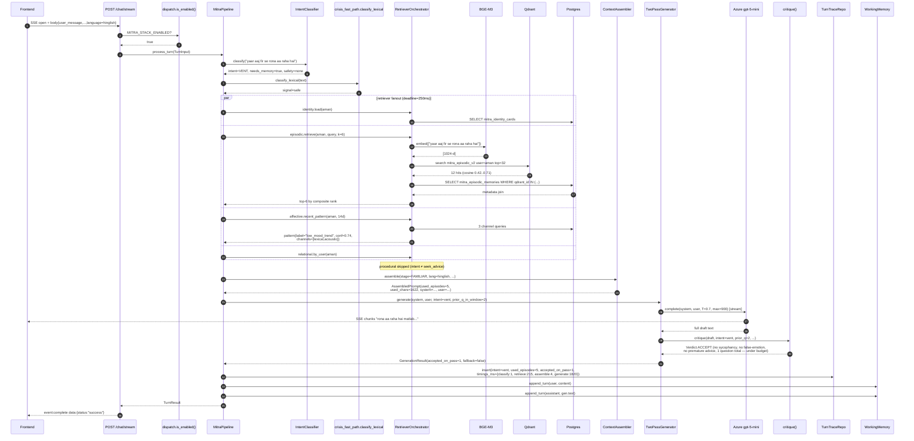

---

## 13. Failure Modes → Mitigations (designed-in)

| Failure | Where caught | Mitigation |
|---|---|---|
| **Wrong memory retrieved** | composite-rank in `episodic.retrieve()` | importance × strength × cosine; archived rows excluded |
| **Stale memory** | decay sweep | exponential decay; auto-archive at strength ≤ 0.10 |
| **Creepy over-personalization** | Stage gate + assembler budget | Stranger Stage uses ≤600 chars of context; callbacks reserved for FAMILIAR+ |
| **Sycophancy** | critic R1 | regex blocks → SOFT_REWRITE |
| **False emotion** | critic R2 | "I'm sad too" forbidden → REJECT |
| **Memory hallucination** | critic R4 | claims must be supported by retrieved_summaries |
| **Question interrogation** | critic R5 + R6 | Stage-aware per-turn + windowed cap |
| **Multilingual embedding gap** | dual embedder | BGE-M3 primary (multilingual), Gemini fallback |
| **Provider outage (Azure)** | `with_fallback` | falls through to Z.AI GLM-4-32B |
| **Slow memory channel** | retriever deadline | 250 ms hard cap; channel marked `errors[name]=deadline` |
| **Crisis missed** | layered detection | lexical (3ms) → LLM confirmer (≤6s) → critic safety rule |
| **PII in logs** | `core/pii.py::redact_text` | applied at every log site that touches user text |
| **DB write failure** | `_safe_trace` / `_safe_working_memory_append` | swallowed + logged; turn still returns |
| **Cold start** | speculative pre-fetch + prewarm threads | `/chat` daemon pre-warms emotional trend at request entry |

---

## 14. How to Drive It (operator's quick reference)

```bash
# Activation (single switch).
export MITRA_STACK_ENABLED=1

# Optional per-role model overrides (format: provider:model).
export MM_MODEL_GENERATOR_PRIMARY=glm:glm-4-32b-0414-128k
export MM_MODEL_CLASSIFIER=groq:llama-3.3-70b-versatile

# Tunables.
export MITRA_RETRIEVE_DEADLINE_MS=300        # default 250
export QDRANT_COLLECTION_MITRA=mitra_episodic_v2
export QDRANT_COLLECTION_REFLECTIONS=mitra_reflections_v2

# Initialise infrastructure (idempotent).
psql … -f supabase/migrations/20260420120000_mitra_memory_v2.sql
python chatbotAgent/scripts/qdrant_init_mitra.py

# Run the gate.
make test-health      # backend (200 tests) + frontend build
make test-health-full # adds live Supabase + Qdrant integration

# Inspect what MITRA remembers about a user.
curl -H "Authorization: Bearer $JWT" https://api.../me/memory?limit=20
```

---

## 15. What you can teach yourself with this doc

1. Read **§2 (per-turn pipeline)** end-to-end. Trace one box at a time into
   the file map (§11) and skim the linked module — every box maps to ≤200
   lines of code.
2. Open `chatbotAgent/tests/health/test_mitra_pipeline_v2.py` and run
   `pytest -k orchestrator -s`. Each test exercises one branch of §2.
3. Flip `MITRA_STACK_ENABLED=1` in a dev shell, hit `/chat` with curl, then
   read `mitra_turn_traces` for that user — the row is the §2 diagram with
   real timings filled in.
4. Set `MM_MEMORY_TRACE=1` and chat twice with the same user — watch the
   second turn pull the first turn's memory through the §4.2 sequence
   diagram.
5. Run the consolidation worker manually: `python -c "from app.jobs.consolidation_worker
   import ConsolidationWorker; ..."` and watch the §6 stages report numbers
   for one user.

---

*Document generated alongside the v2 stack at the close of Phase 6. Every
constant cited here can be grepped in `chatbotAgent/app/` — if it diverges
from the code, the code wins.*
