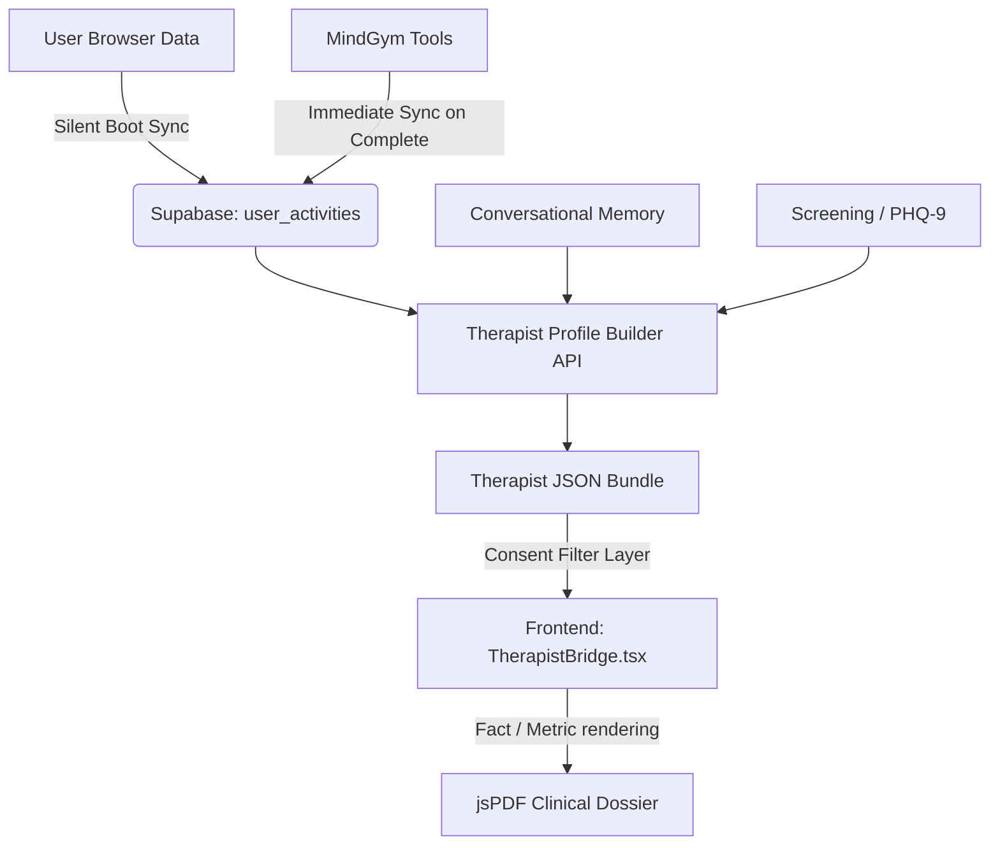

# Therapist Bridge Architecture

## Purpose
The Therapist Bridge is a secure, clinical-grade interface linking offline self-administered therapeutic tools (MindGym) and AI conversational memory with professional clinical oversight. It securely surfaces "trapped" behavioral data to empower therapists without breaching user privacy or hallucinating diagnostic claims.

## Core Principles
1. **No Hallucination**: All metrics surfaced to the clinician must be hard-linked to verifiable user actions (e.g., "Patient utilized the Panic Button 3 times").
2. **Consent Driven**: The user retains full control over what vectors of data are exposed to the clinical brief.
3. **Data Loss Prevention**: Data collected via offline local storage in MindGym must be efficiently synchronized to the canonical backend DB (`user_activities`).

## Architecture Flow

## System Components

### 1. Synchronization Layer (Frontend)
- **Immediate Push**: `ToolShell.tsx` ensures `syncMindGymClinicalDataToSupabase()` is fired immediately when a user finishes a MindGym exercise.
- **Silent Boot Fallback**: In the event of network dropouts during exercise completion, `App.tsx` intercepts the offline data block implicitly and pushes it asynchronously to Supabase.
- **Deduplication Hashing**: Data packets generate a 32-bit checksum (`data_hash`). Existing hashes in the `user_activities` block duplicate writes. 

### 2. Clinical Aggregation (Backend Python)
- **File**: `chatbotAgent/app/services/therapist_profile_builder.py`
- Fetches time-bounded structured data (`_fetch_activities_window`, `_fetch_crisis_events`).
- Generates deterministic metric properties for the UI payload.
    - **Layer A**: Objective Empirical Facts (Assessments).
    - **Layer B**: Objective Metrics & Observations (e.g., MindGym extractions: Documented Worries, Catastrophizing Bias counts).
    - **Layer C**: Sub-conscious Conversational Themes mapped from LLM session summaries.

### 3. Presentation / PDF Generation
- **File**: `src/lib/utils/exportClinicalPDF.ts`
- Bypasses raw DOM rendering algorithms (like `html2canvas`) and utilizes purely programmatic `jsPDF`.
- Evaluates `ConsentState` explicitly before writing each document layer. 
- Injects a strict SOTA Guardrail Disclaimer prohibiting usage as a primary diagnostic instrument.

## Update Propagation Rule
If the Therapist Bridge exposes new metrics, `therapist_profile_builder.py` must align its extraction logic, and `exportClinicalPDF.ts` must be updated to render the new `profileData.patterns` structurally.
