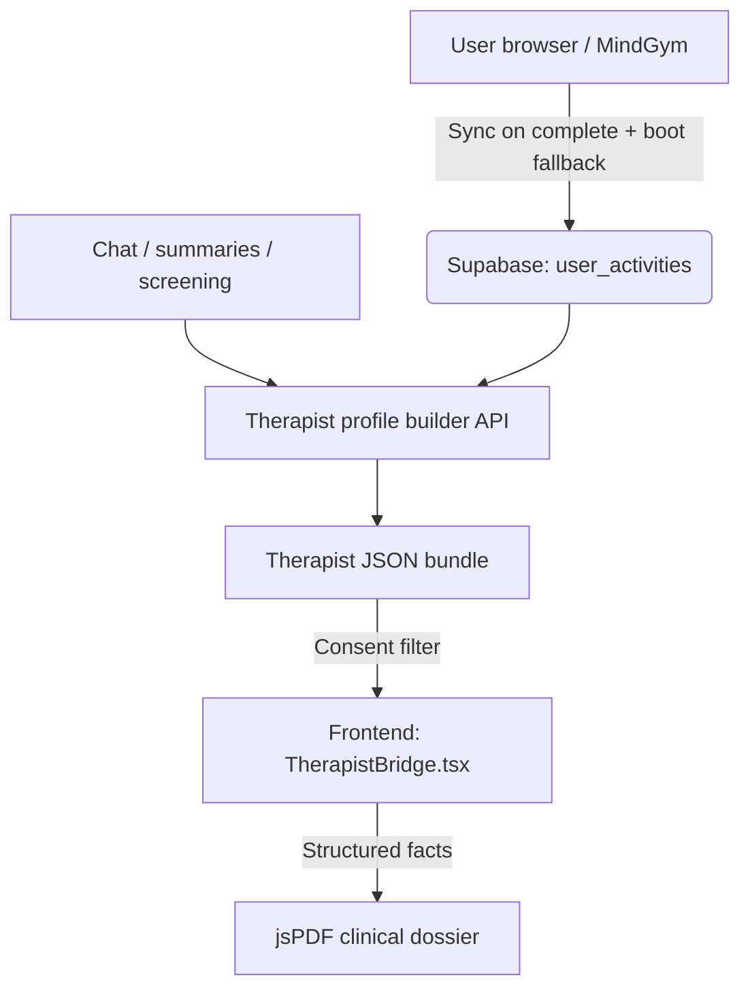

# Therapist Bridge — architecture, evaluation, and operations

## Purpose

The Therapist Bridge is a **consent-driven** path from in-app activity (MindGym, chat-derived signals, optional screening) to a **structured clinician-facing brief**. It must surface **verifiable metrics** linked to user actions — not free-form diagnostic claims from the model.

## Core principles

1. **No hallucinated clinical facts** — Metrics shown to a clinician must tie to stored events (for example, “used Panic Button N times” from `user_activities` / crisis tables), not invented severity.
2. **User consent** — The user controls which vectors of data appear in the exportable brief.
3. **Data loss prevention** — MindGym completion data should reach the canonical backend (`user_activities`) promptly; offline paths need sync on next launch.

## Architecture flow

## System components

### Synchronization (frontend)

- **On complete:** `ToolShell.tsx` should call `syncMindGymClinicalDataToSupabase()` when a MindGym exercise finishes.
- **Boot fallback:** If a completion was missed offline, `App.tsx` can flush pending blocks asynchronously (see implementation for current behavior).
- **Dedup:** Activity payloads use a checksum (`data_hash`); duplicate hashes should not create duplicate clinical rows.

### Aggregation (backend)

- **Primary module:** `chatbotAgent/app/services/therapist_profile_builder.py`
- Fetches time-bounded structured data (activities, crisis events where applicable).
- Builds deterministic layers for the UI payload, for example:
  - **Layer A** — Objective structured inputs (assessments).
  - **Layer B** — Countable MindGym-derived metrics (documented worries, bias tallies, etc.).
  - **Layer C** — Thematic summaries from session summaries (non-diagnostic language).

### Presentation / PDF

- **Module:** `src/lib/utils/exportClinicalPDF.ts`
- Uses programmatic **jsPDF** (not DOM screenshot pipelines) for predictable output.
- Respects `ConsentState` per section; includes a clear **not a substitute for clinical assessment** disclaimer.

### Propagation rule

If the Bridge exposes **new** metrics end-to-end, update **`therapist_profile_builder.py`** extraction, the frontend types/payload mapping, and **`exportClinicalPDF.ts`** so PDF and UI stay aligned.

---

## Evaluation and red-team (production discipline)

### Clinical utility rubric (pilot)

For anonymized snapshots, licensed reviewers score **1–5**:

1. **Time saved** — Reduces intake repetition without replacing assessment?  
2. **Context quality** — Themes aligned with what matters at first contact?  
3. **Misleading risk** — Any line could misdirect (inflated severity, false certainty)?  
4. **Safety framing** — Crisis rows non-verbatim where required; escalations clear?

**Targets:** median ≥4 on (1) and (2); ≤2 on (3); ≥4 on (4).

### Red-team narratives (after model or prompt changes)

- Plain stress language must not be rewritten as disorder labels (depression, GAD, PTSD, etc.) unless sourced from a structured instrument the user completed.
- Bullets with empty or invalid `evidence_refs` must be dropped by the validator.
- Code-mixed or non-English themes must not produce stereotyped cultural judgments.
- Sparse data (no activities, no summaries) must show **data gaps**, not fabricated patterns.

### Technical regression

- `python -m pytest chatbotAgent/tests/test_therapist_bridge.py`
- Smoke: `POST /therapist-bridge/profile-preview` with a valid JWT returns expected shape (e.g. `emotionalProfile`, `disclaimer`).

### Operations

- Record **model id** and **prompt hash** on snapshots where stored (e.g. `therapist_profile_snapshots`) for reproducibility.
- **Never** log `clinician_view_token` or raw chat in therapist export pipelines.

---

## Related docs

| Topic | Doc |
|-------|-----|
| Doc hub | [`docs/README.md`](README.md) |
| HTTP contracts | [`docs/api_contracts.md`](api_contracts.md) |
| System architecture | [`docs/architecture.md`](architecture.md) |
